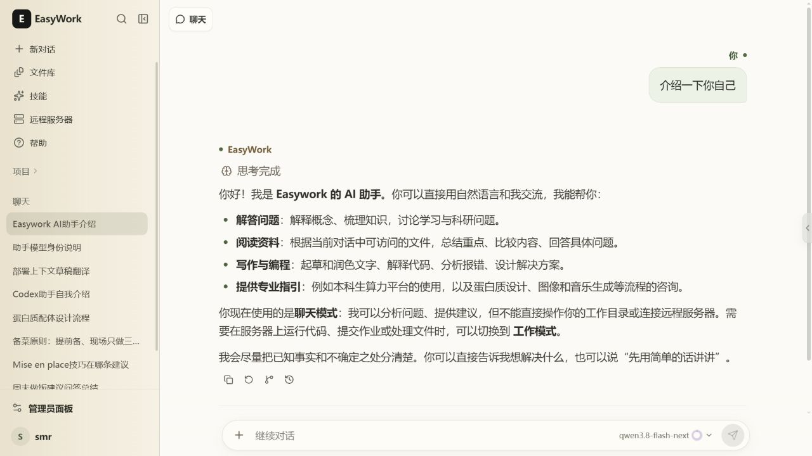
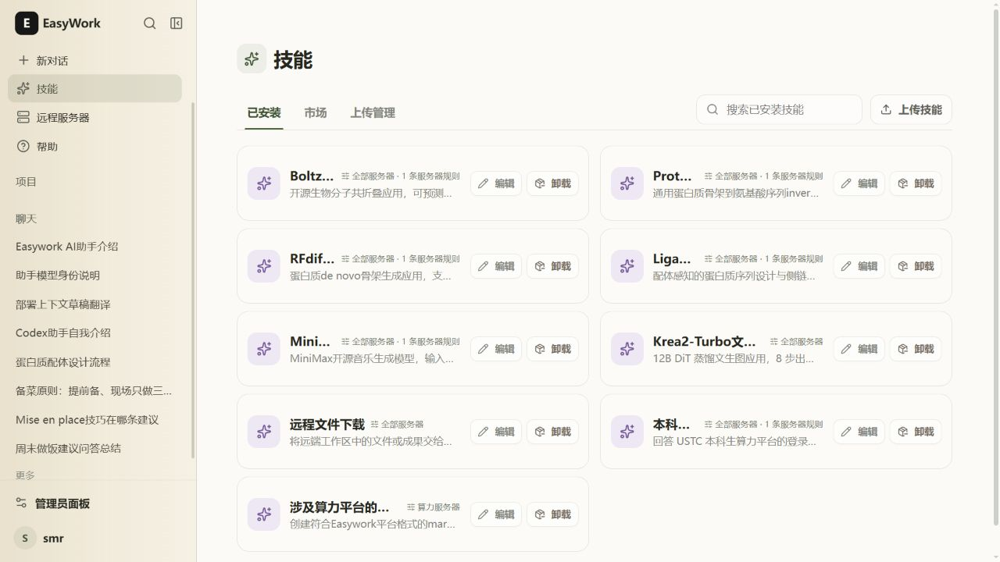

<h1 align="center">EasyWork</h1>

<p align="center">
  
</p>

<p align="center">
  
  
  
  
</p>

<p align="center">
  <b>简体中文</b> · <a href="README.md"><b>English</b></a>
</p>
<p align="center">
  <a href="#功能亮点">功能亮点</a> · <a href="#下载安装">下载安装</a> · <a href="#快速上手">快速上手</a> · <a href="#常见问题">常见问题</a>
</p>

## EasyWork 是什么？

**EasyWork 是一个连接 AI、个人知识与远程服务器的对话工作台。** 在浏览器里聊天、检索资料，也可以通过 SSH 让 Agent 在远端工作区编写代码、处理文件和运行计算任务。对话、文件、终端、服务器资源与作业状态集中在同一个界面中。

项目已接入 **OpenCode、Codex、Claude Code 和 Qoder CN**，支持项目与文件集、技能管理、多层记忆和跨设备继续工作。EasyWork 部署在自己的 Windows 或 Linux 主机上，Agent 则运行在连接的 Linux 服务器上。

## 功能亮点

### 💬 聊天与工作

- **聊天模式**：结合模型、文件、技能和记忆进行问答，无需连接服务器。
- **工作模式**：选择服务器、Agent 和工作区；网页侧准备相关资料，远端 Agent 接收原始需求并完成规划、执行与回复。
- **流式对话**：实时查看回复、工具活动和任务进度；按 Agent 能力支持追加消息、中断、审批与上下文压缩。
- **图片与附件**：上传或粘贴图片，使用视觉模型理解内容；工作模式可把手动附加的原始文件交给远端 Agent。

### 🖥️ 远程工作台

- 使用 SSH 密码或密钥连接服务器，支持交互验证与服务器指纹确认。
- 在浏览器里浏览、上传、下载和预览远端文件，打开终端并查看计算资源。
- 在 Slurm 服务器上提交、取消和跟踪作业；已登记作业的状态会持续更新。
- 同一账号可跨设备继续使用连接、终端和对话；EasyWork 主机保持运行时，关闭网页不会中断后台任务。

### 📚 文件、项目与记忆

- 将资料整理为文件集，关联到项目或对话，检索文本、Markdown、PDF 和 Word 等内容。
- 保留用户偏好、项目背景和对话中的稳定事实，让后续交流延续已有上下文。
- 使用 `@` 明确引用其他对话，结合相关记录继续讨论。
- 在对话中查看生成的文件与图片，放大预览或下载结果。

### 🧩 四种 Agent 与自定义技能

- 在 **OpenCode、Codex、Claude Code、Qoder CN** 之间选择，为各 Agent 配置模型与可用的运行选项。
- OpenCode、Codex 和 Claude Code 使用配置的模型服务；Qoder CN 使用自己的账号登录、模型目录与额度。
- 从技能市场安装技能，或上传、编辑自己的技能，为聊天、工作或全部模式设置适用范围。
- 技能的服务器类型、白名单与黑名单只限制工作模式；选择「全部模式」的技能仍可在聊天模式使用。
- 切换 Agent 或服务器时分别保留会话，切回后继续；同一 Agent、同一服务器下切换工作区可延续原会话。



### 🌿 会话分支与文件历史

- 为对话创建分支，或回到较早的消息继续探索。
- 协调对话回溯与受跟踪的远端文件版本；发现文件冲突时提示处理，避免覆盖后续修改。
- 自动文件历史独立于工作区 Git，具体回溯能力取决于 Agent 支持情况和文件状态。

### 🌐 自主部署与多端访问

- 在电脑或手机浏览器中访问同一套 EasyWork。
- 账号数据与加密凭据保存在部署主机上，不同账号分别管理自己的资料与连接。
- 使用个人模型 API，或由管理员配置共享模型、Embedding 和 OCR 服务。

## 下载安装

仅提供 **x86-64 / AMD64** 发布包，Windows 10 和 Windows 11 共用一个包。

| 部署主机 | 发布包 | 运行环境 |
| --- | --- | --- |
| Windows 10 / 11，x64 | `easywork-0.1.2-windows-x64.zip` | 内置 Node.js |
| Ubuntu 22.04 及以上，x64 | `easywork-0.1.2-linux-x64.tar.gz` | 内置 Node.js |
| CentOS 7.9，x64 | `easywork-0.1.2-linux-centos7-x64.tar.gz` | 内置兼容 glibc 2.17 的 Node.js |

从 [Releases 页面](../../releases) 下载对应包。自行构建的文件位于 `releases/`，附带 `SHA256SUMS.txt` 校验文件。解压后即可启动网页服务，无需另装 Node.js。

CentOS 7 请使用专用包，其中的 Node.js 来自 [glibc 2.17 社区构建](https://github.com/nodejs/unofficial-builds#builds)。

### 自行安装 Agent

**发布包不包含已下载的 Agent 应用。** `agent-app/` 仅提供对应主机系统的下载脚本、固定版本清单和脚本所需文件；请按需下载所选 Agent，再从网页安装到远端服务器。普通聊天无需执行这一步。

本版 EasyWork 固定使用以下版本，脚本不会自动追踪上游最新版：

| Agent | 脚本中的名称 | 固定版本 |
| --- | --- | --- |
| OpenCode | `opencode` | `1.18.30` |
| Codex | `codex` | `0.154.0` |
| Claude Code | `claudecode` | `2.1.269` |
| Qoder CN | `qodercncli` | `1.1.53` |

在解压目录运行对应命令，把 `codex` 换成需要的名称：

```powershell
# Windows 10 / 11：只下载 Codex
.\agent-app\update-agent-app.cmd --agent codex --platform linux-x64

# 也可以使用 PowerShell 脚本
.\agent-app\update-agent-app.ps1 -Agent codex -Platform linux-x64
```

```bash
# Ubuntu / CentOS 7：只下载 Codex
sh agent-app/update-agent-app.sh --agent codex --platform linux-x64
```

- **按需选择**：`--agent opencode,codex` 下载指定的多个 Agent；只有显式使用 `--all` 才下载全部四种。不带参数只显示帮助。
- **远端平台**：`--platform` 指 Agent 将运行的 Linux 服务器，默认 `linux-x64`；也支持 `linux-x64-musl`、`linux-arm64` 和 `linux-arm64-musl`，多个值用逗号分隔。Windows 主机同样下载远端 Linux 安装文件。
- **校验与补装**：自动校验 SHA-256 和大小，完整文件会复用；重新运行相同命令可补齐或修复文件。追加 `--check` 仅离线检查；PowerShell 对应 `-Check`，选择全部对应 `-All`。
- **兼容版本**：下载 Claude Code 的 `linux-x64` 时一并准备 `2.1.170`，供旧 glibc 环境选择；Qoder CN 同时准备 `1.1.53` 的 baseline 包。EasyWork 根据远端能力选择可用制品，各 Agent 的系统要求仍有区别。

下载完成后，在工作模式连接 SSH，打开 Agent 选择面板并点击「安装」；已安装的托管 Agent 可通过「更新」与本版固定清单同步。再为所选 Agent 配置模型服务，或完成 Qoder CN 账号登录。下载脚本使用发布包内置的 Node.js，源码部署则需要 Node.js 22.13 或更高版本。

## 快速上手

### 1. 启动服务

**Windows**：解压 `easywork-0.1.2-windows-x64.zip`，进入目录，双击 **`start.cmd`**。

**Ubuntu**：

```bash
tar -xzf easywork-0.1.2-linux-x64.tar.gz
cd easywork-0.1.2-linux-x64
./start.sh
```

**CentOS 7**：

```bash
tar -xzf easywork-0.1.2-linux-centos7-x64.tar.gz
cd easywork-0.1.2-linux-centos7-x64
./start.sh
```

在部署主机打开 **[http://127.0.0.1:8001](http://127.0.0.1:8001)**。网络允许时，其他设备可访问 `http://主机IP:8001`。使用期间保持服务运行，在启动终端按 `Ctrl+C` 停止服务。

### 2. 注册与设置管理员

首次部署没有预设账号或密码，**第一个注册的账号自动成为管理员**。先完成首次注册，再向其他用户开放服务。管理员可从侧栏的「管理员面板」配置共享模型、Embedding 和 OCR 服务。

增加管理员时，先让用户注册，再编辑数据目录中的 `admins/adminList`（默认 `data/admins/adminList`），使用 UTF-8 文本，每行填写一个已注册的用户名。删除对应行可撤销权限；修改后重新登录刷新界面，并至少保留一名管理员。设置了 `EASYWORK_DATA_ROOT` 时，请使用该目录下的同名文件。

### 3. 配置模型并开始任务

1. 在个人资料的「模型 API」中填写 API URL 和 Key，或选择管理员提供的模型服务。
2. 选择模型开始聊天；可添加文件集、技能与对话引用。文件语义检索需要 Embedding 服务，图片理解优先使用视觉模型，不支持时可用已配置的 OCR 服务。
3. 使用工作模式前，按上文脚本下载需要的 Agent，连接 SSH 并完成远端安装，选择工作区后发送任务。
4. 在同一页面查看回复、工具活动、终端、远端文件与作业状态。

更多操作说明见 [使用帮助](help/help.md)。

## 配置与数据

将 `.env.example` 复制为 `.env`，修改后重新启动。常用设置为对外端口 `EASYWORK_WEB_PORT`（默认 `8001`）和数据目录 `EASYWORK_DATA_ROOT`（建议使用绝对路径，默认是程序旁的 `data/`）。

备份时保存**完整数据目录**，包括其中的加密材料。升级前停止服务，将新版本解压到独立目录，复用原有数据目录与配置，再按需下载 Agent。游客数据为临时数据，需要长期保留的工作请使用账号。

公网部署可配置支持 WebSocket 的 HTTPS 反向代理，内部渲染端口无需对外开放。调用模型时，相关上下文会发送到所配置的模型服务。

## 常见问题

**关闭网页后，任务还会继续吗？**  
会，只要 EasyWork 主机进程仍在运行。主机重启后需要重新连接 SSH，任务恢复取决于执行状态和 Agent 的原生会话记录。

**为什么解压后还要下载 Agent？**  
发布包提供网页服务和对应系统的下载脚本，Agent 应用由用户按需准备。只使用聊天模式不需要下载；使用工作模式时选择所需 Agent 即可。

**部署主机和工作服务器必须是同一台吗？**  
不必。浏览器连接 EasyWork 主机，主机通过 SSH 连接 Linux 工作服务器；Agent 的架构和系统要求以工作服务器为准。

**可以完全离线使用吗？**  
界面由自己的主机提供。聊天、检索和 Agent 任务依赖配置的服务，离线使用需要这些服务及必要安装文件在本地可用。

## 本地开发

使用 **Node.js 22.13 或更高版本**：

```bash
npm ci
npm run build
npm start
```

开发时分别运行 `npm run gateway` 与 `npm run dev`。按需准备 Agent：

```bash
npm run agents:download -- --agent codex --platform linux-x64
```

`npm run test:gateway` 运行测试，`npm run lint` 检查代码。提交修改后，运行 `npm run release` 生成三个平台的发布包；打包另需 Python 3.9+ 和 `tar`，无需预先下载 Agent。各包仅附对应系统的 Agent 下载脚本与固定清单。
