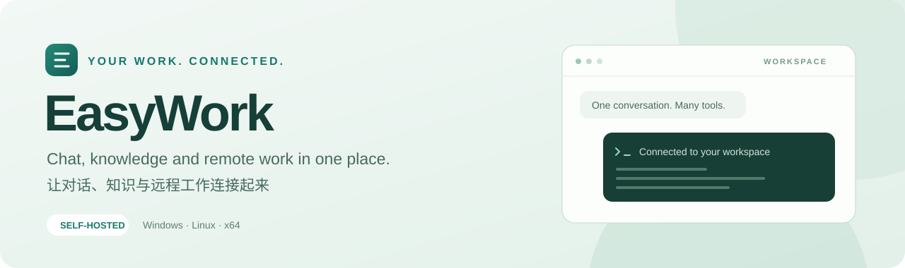

<p align="center">
  
</p>

<p align="center">
  
  
  
  
</p>

<p align="center">
  <b>简体中文</b> · <a href="README.md"><b>English</b></a>
</p>
<p align="center">
  <a href="#功能亮点">功能亮点</a> · <a href="#下载安装">下载安装</a> · <a href="#快速上手">快速上手</a> · <a href="#常见问题">常见问题</a>
</p>

## EasyWork 是什么？

**EasyWork 是一个连接 AI、个人知识与远程服务器的对话工作台。** 在聊天模式中提问，在工作模式中让 Agent 操作远端工作区；对话、文件、终端和任务结果，都可以在浏览器里查看和管理。

接入 **OpenCode、Claude Code 或 Codex**，把常用资料整理成项目和文件集，也能换一台设备继续之前的工作。EasyWork 部署在您自己的主机上，远程任务则通过 SSH 在您连接的 Linux 服务器上执行。

## 功能亮点

### 💬 聊天与工作 — 从提问到执行

- **聊天模式**：使用自己配置的模型 API，按需结合相关文件、技能与记忆回答问题。
- **工作模式**：选择服务器、Agent 和工作区，用自然语言描述要完成的任务。
- **过程可见**：在对话中查看工具活动、命令执行、回复和生成的文件。
- **持续执行**：只要 EasyWork 主机仍在运行，关闭网页不会取消正在执行的任务。

### 🖥️ 远程工作区 — 在浏览器里使用服务器

- 通过 SSH 密码或密钥连接多台服务器，并在需要时完成交互验证。
- 浏览、预览远端文件，打开终端，查看服务器资源。
- 使用已有目录，或创建由 EasyWork 管理的临时工作区。
- 在提供 Slurm 的服务器上查看、提交和取消作业。

### 📚 文件与记忆 — 让需要的资料参与工作

- 将资料整理成文件集，关联到对话或项目。
- 检索文本、Markdown、PDF 和 Word 文档；图片识别需要配置 OCR 模型。
- 保留有用的个人偏好与项目背景，并控制项目记忆的范围。
- 使用 `@` 引用其他对话，也可以搜索历史对话内容。

### 🧩 Agent 与技能 — 使用顺手的工具继续任务

- 在 OpenCode、Claude Code 和 Codex 之间切换，为选定的会话补充相关上下文。
- 从技能市场安装技能，或上传自己的技能，并设置适用范围。
- 对对话创建分支或回溯，并协调远端文件历史；具体能力取决于 Agent 支持情况和文件冲突状态。

### 🌐 自主部署 — 一个账号，多端继续

- 从电脑或手机浏览器访问同一套 EasyWork。
- 账号数据与加密凭据保存在您部署 EasyWork 的主机上。
- 使用自己的模型服务，也可以由管理员提供共享服务。

## 下载安装

仅提供 **x86-64 / AMD64** 发布包，Windows 10 和 Windows 11 共用一个包。

| 部署主机 | 发布包 | 运行环境 |
| --- | --- | --- |
| Windows 10 / 11，x64 | `easywork-0.1.1-windows-x64.zip` | 内置 Node.js |
| Ubuntu 22.04 及以上，x64 | `easywork-0.1.1-linux-x64.tar.gz` | 内置 Node.js |
| CentOS 7.9，x64 | `easywork-0.1.1-linux-centos7-x64.tar.gz` | 内置兼容 glibc 2.17 的 Node.js |

发布文件可放到仓库的 [Releases 页面](../../releases)。本地构建结果位于 `releases/`，同时提供 `SHA256SUMS.txt` 用于校验文件完整性。

CentOS 7 包使用 Node.js 项目的 [glibc 2.17 社区构建](https://github.com/nodejs/unofficial-builds#builds)。CentOS 7 的系统库不能运行普通 Linux 包中的 Node.js，请选择专用包。该包用于兼容旧环境，CentOS 7 本身已停止上游维护。

解压后启动的是网页服务，使用浏览器访问即可，无需安装桌面客户端或单独安装 Node.js。使用模型和远程功能时，需要能够访问对应的模型服务与 SSH 服务器。

### Agent 安装与更新

**三个发布包均已内置 OpenCode、Codex 和 Claude Code 的 Linux x64 应用**，包括 glibc 与 musl 版本。解压后即可在 EasyWork 中为已连接的远端服务器安装 Agent。

源码仓库提供安装清单和更新脚本，应用文件由用户自行下载。使用源码部署或需要补装时，在项目或安装目录下运行对应脚本：

```powershell
# Windows 10 / 11
.\agent-app\update-agent-app.cmd
```

```bash
# Ubuntu / CentOS 7
sh agent-app/update-agent-app.sh
```

默认按清单下载固定版本并校验 SHA-256，已有完整文件会跳过下载。加 `--latest` 下载最新版本，或加 `--check` 仅检查本地文件；可用 `--agent codex` 单独选择一个 Agent。Windows 也提供 `update-agent-app.ps1`，对应参数为 `-Latest`、`-Check` 和 `-Agent codex`。发布包使用内置 Node.js；源码部署需先准备 Node.js 22.13 或更高版本。

文件就绪后，在工作模式连接 SSH，打开 Agent 选择面板，点击「安装」；已有托管 Agent 可点击「更新」检查并安装新版，再配置模型 API。脚本负责准备主机上的安装文件，网页中的操作将 Agent 安装到远端服务器。

Agent 目前运行在**远端 Linux x64 服务器**上，Windows 发布包也包含这些远端应用。各 Agent 的系统要求不同；EasyWork 主机可运行 CentOS 7，不代表所有 Agent 均可在 CentOS 7 远端运行。

## 快速上手

### Windows

解压 `easywork-0.1.1-windows-x64.zip`，进入解压后的文件夹，双击 **`start.cmd`**。使用期间请保持启动窗口运行。

### Ubuntu

```bash
tar -xzf easywork-0.1.1-linux-x64.tar.gz
cd easywork-0.1.1-linux-x64
./start.sh
```

### CentOS 7

```bash
tar -xzf easywork-0.1.1-linux-centos7-x64.tar.gz
cd easywork-0.1.1-linux-centos7-x64
./start.sh
```

在部署主机打开 **[http://127.0.0.1:8001](http://127.0.0.1:8001)**。网络和防火墙允许时，其他设备可通过 `http://主机IP:8001` 访问。在启动终端按 `Ctrl+C` 可停止服务。

### 管理员设置

首次部署没有预设管理员账号或密码，**第一个注册的账号自动成为管理员**。请先完成注册，再将服务开放给其他用户；登录后可在侧栏进入「管理员面板」配置共享模型、Embedding 和 OCR 服务。

需要增加管理员时，先让该用户注册，再编辑数据目录中的 `admins/adminList`（默认路径为 `data/admins/adminList`）。使用 UTF-8 文本，每行填写一个已注册的用户名；删除对应行即可撤销管理员权限。修改后让用户重新登录以刷新界面，并至少保留一个管理员。设置了 `EASYWORK_DATA_ROOT` 时，请修改该目录下的同名文件。

### 开始第一个任务

1. **注册账号**：首个注册用户会成为管理员，新部署请先完成注册，再开放给其他用户。
2. **配置模型 API**：打开个人资料中的「模型 API」，填写 API URL 和 Key，或选择管理员提供的模型服务。
3. **发起聊天**：选择模型，发送第一条消息。文件索引需要配置 Embedding 服务，图片识别还需要管理员配置 OCR 服务。
4. **尝试工作模式**：连接 SSH 服务器，配置 Agent，选择工作区，然后描述要完成的任务。

更详细的操作说明见 [使用帮助](help/help.md)。

## 配置与数据

发布包中，将 `.env.example` 复制为 `.env`，修改后再启动即可。常用设置包括对外端口 `EASYWORK_WEB_PORT`（默认 `8001`）和数据目录 `EASYWORK_DATA_ROOT`（建议使用绝对路径，默认是程序旁的 `data/`）。

备份时请保存**完整数据目录**，包括其中的加密材料。升级时先停止服务，将新版本解压到另一个文件夹，再复用原有数据目录与配置。游客数据是临时数据，需要长期保留的工作请使用账号。

公网使用时，为 `8001` 端口配置支持 WebSocket 的 HTTPS 反向代理，内部渲染端口无需对外开放。文件与凭据存储在部署主机上；调用模型时，选中的上下文会发送给您配置的模型服务商。

## 常见问题

**关闭网页后，任务还会继续吗？**  
会，前提是 EasyWork 主机进程保持运行。主机重启后需要重新连接 SSH；任务能否恢复，取决于任务状态与 Agent 可用的原生会话记录。

**普通聊天也需要 SSH 服务器吗？**  
不需要。聊天模式只需配置模型服务；工作模式使用已连接的 Linux 服务器。

**EasyWork 会自动改写工作区的 Git 历史吗？**  
EasyWork 的自动文件历史与工作区 Git 仓库分别管理。Agent 在执行您安排的任务时，仍然可以运行 Git 命令。

**可以完全离线使用吗？**  
界面由自己的主机提供。聊天、检索与 Agent 任务依赖所配置的服务；离线使用需要这些服务和必要的安装文件都在本地可用。

## 本地开发

使用 **Node.js 22.13 或更高版本**，按锁定文件安装依赖：

```bash
npm ci
npm run build
npm start
```

开发时，在两个终端分别运行 `npm run gateway` 与 `npm run dev`。`npm run test:gateway` 运行测试，`npm run lint` 检查代码。

先执行 `npm run agents:download` 准备 Agent 应用，再运行 `npm run release` 生成三个平台的完整发布包。构建还需要 Python 3.9+ 和 `tar`；每个发布包都会包含 Agent 应用及对应系统的更新脚本。

```text
app/          网页界面
gateway/      应用服务与远程工作
shared/       共用工具
prompts/      模型提示词与技能定义
help/         使用帮助
doc/          机制与 Agent 说明
scripts/      构建、启动和发布工具
tests/        自动化测试
```
