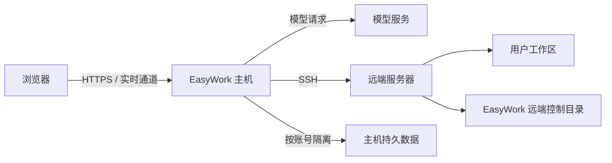

# EasyWork SSH 机制

本文定义浏览器、EasyWork 主机与远端服务器之间唯一的连接模型。它覆盖账号隔离、服务器身份、凭据、连接复用、断线恢复、远端能力和安全边界，不描述具体源码。

## 1. 总体边界

浏览器只连接 EasyWork 网页。SSH、远端文件、终端、Agent、调度器、版本管理和必要的模型 API 中继均由 EasyWork 主机发起。

由此得到以下不变量：

- 浏览器不接触 SSH 私钥明文，也不直接打开远端端口；
- 浏览器关闭、刷新或换设备不等于断开 SSH，也不取消后台任务；
- SSH socket 只存在于当前主机进程；主机重启后统一清除旧连接意图并显示已断开，等待用户主动连接；
- 所有远端操作都先恢复当前账号，再校验服务器、身份和能力，不能只相信浏览器传来的对象标识。

## 2. 账号、设备与数据隔离

登录用户和访客都作为独立 Actor。服务器配置、加密凭据、连接意图、对话绑定、任务和审计记录均属于 Actor；不同 Actor 不共享凭据、连接对象或并发额度。

同一账号在多设备登录时共享主机保存的服务器配置和真实连接状态。设备只保存 Web 会话与交互偏好，不能凭本地缓存授予 SSH 权限。退出一个网页会话只撤销该 Web 会话，不影响同账号其他设备和仍在运行的远端任务。

SSH Worker 的内存身份只由 Actor 类型和 Actor ID 组成，明确不包含 deviceId、Web sessionId、对话 ID 或 Task ID。因此同一账号从电脑、手机或多个浏览器访问同一服务器时，必须命中同一个 Worker 和同一条存活的底层 SSH 连接；设备身份只用于审计和浏览器附件状态。

主机持久数据采用 Actor 隔离目录。密钥、令牌和凭据与用途及 Actor 绑定加密；把密文复制到另一个账号目录不能解密使用。结构化状态以修订号、原子替换和幂等命令保护，避免旧页面覆盖新状态或网络重试重复执行。

## 3. 服务器配置与凭据

服务器资料包含显示名称、主机、端口、用户名、认证方式和公开状态。认证可使用：

- 用户名与密码；
- 私钥，可带私钥口令；
- 一次性验证码或其他交互式补充信息，但此类信息不持久化。

密码、私钥和口令与公开资料分开保存。普通读取只返回“是否已配置”和掩码；短时显示必须由专用敏感读取完成、禁止缓存并自动过期。完整私钥永不返回普通页面。

服务器可以来自 EasyWork 内保存的资料，也可以由用户从本机 SSH 配置明确导入。导入只复制所需连接参数和凭据引用，不把任意本机配置内容发送给模型。

## 4. 服务器身份与首次确认

一次可靠连接依次执行：

1. 读取服务器资料和当前平台网络策略；
2. 解析主机名并检查全部解析地址、目标端口和禁止网段；
3. 固定使用已经通过检查的地址建立连接；
4. 获取主机公钥指纹；
5. 首次见到该主机时暂停并要求用户确认；
6. 保存确认后的身份，再开始认证；
7. 后续连接必须匹配已确认身份。

稳定服务器身份由主机、端口和已确认指纹共同决定。指纹变化代表服务器可能被替换，必须停止复用连接、工作区、Agent 会话和对话文件账本；系统不得自动接受新指纹。

域名解析后的每个地址都必须满足策略，只要其中一个地址不允许就拒绝连接。实际传输固定到已验证地址，避免检查后再次解析产生地址漂移。

## 5. SSH Worker 与连接复用

主机为每个 Actor 维护独立的 SSH Worker。一个 Worker 可管理该 Actor 的多台服务器；同一已确认服务器的底层连接可以被多个对话、工作区和远端能力复用。

SSH Worker 属于主机级连接池，不属于某个 HTTP 请求或短时页面服务容器。页面服务容器因空闲被回收时不得关闭 Worker；只要连接仍在策略允许的用户活动期限内，主机就继续保活。同一主机进程内，浏览器刷新、关闭或换设备都直接复用这条连接。主机进程重新启动时只在本地归一化遗留状态，不访问远端、不自动认证，也不让服务器列表、对话、技能或登录等待 SSH；用户下一次主动点击连接后才创建新 socket。

连接复用与业务会话复用是两件事：

- 多个网页对话可以共享一条 SSH 连接；
- 每个对话仍拥有独立的分支、工作区路由、Task 和 Agent 原生会话；
- 解除一个对话的服务器绑定不会关闭仍被其他对话使用的连接；
- Task、运行编号或单次请求编号不得进入 SSH 连接身份，也不得被误当作 Agent 原生会话身份。

系统同时限制单账号和全平台连接数量、并发通道数量、捕获输出大小和空闲资源。某项能力耗尽或失败只影响该能力，不把整台服务器错误地标为不可用。

同一底层连接上的 `session` 类 channel（命令、SFTP、PTY、交互式 Agent 进程）使用有界并发闸门；持久 Agent 进程占用的 channel 也计入额度，避免文件版本、Skill 准备和 Agent 预热并行时冲破服务端 `MaxSessions`。若 sshd 在 channel 尚未建立、远端命令尚未开始执行前返回 `Channel open failure/open failed`，主机按短退避进行有限重试；一旦 channel 已建立，任何退出、断流或命令错误都不自动重跑。这样既消除瞬时资源竞争，也不会重复执行有副作用的远端命令。

## 6. 连接生命周期

连接状态至少区分连接中、已连接、已断开和失败。前端展示后端真实状态，不用上次缓存冒充已连接。

一次新连接开始后，页面必须立即进入“连接中”，并隐藏该服务器上一次尝试遗留的失败原因。只有本次连接请求实际失败并完成状态刷新后，才显示本次失败原因；不得先闪出旧的“SSH 连接失败”再跳为已连接。

后台恢复与用户交互式连接可能同时到达。若后台尝试未携带动态验证码，而用户随后提交了 2FA，用户请求不得复用并继承前一次认证失败；主机等待后台尝试收敛后，必须使用本次验证码重新认证。并发连接状态不得保存验证码正文，只记录该尝试是否具备交互式凭据。

每个关闭回调必须绑定产生它的具体 SSH session。旧 session 延迟到达的关闭事件若已被新 session 替代，只能丢弃，不能删除新连接或发布瞬时失败状态。已经存在的活跃 session 与持久连接状态不一致时，以存活检查和当前 session 身份为依据修复为已连接并清除旧错误。

“SSH 建连”“对话绑定”和“页面状态刷新”是三个阶段。只有第一阶段失败才显示 SSH 连接失败；建连成功后的对话绑定失败应明确显示“SSH 已连接，但对话关联失败”。页面刷新失败不得反向把已成功的 SSH 标成失败。

- 用户主动发送对话请求、输入终端命令或显式连接/恢复会更新最后活动时间；能力探测、作业/资源轮询、文件列表后台刷新、窗口尺寸变化和保活均不算用户活动；
- 长期无用户主动操作的连接按策略关闭，并清除连接意图；
- 用户可显式断开，操作必须幂等；
- 非预期断线立即使依赖能力不可用，但保留连接意图；维护周期按有界频率尝试恢复，下一次明确操作也可以只对目标服务器触发受控重连；
- 正常关闭主机时关闭 socket 并清除连接意图；异常退出遗留的“连接中/已连接”状态也会在下次启动时归一化为已断开，不自动重新认证。

前端刷新状态时保持已经加载的界面结构。状态轮询或实时 Task 事件不得让“已连接”和 Agent 配置按钮反复闪烁；只有服务器身份、连接代次或用户主动刷新发生变化时才重新探测。

SSH 成功后只在该服务器存在待清理对话时异步续作远端垃圾回收；没有待办项时不建立远端 backend、不扫描 Agent 绑定或版本目录。该工作只处理当前 Actor、当前服务器指纹和本机待办队列能够共同证明归属的 `~/.easywork` 隔离目录；它不阻塞“已连接”返回，也不能把后台部分清理失败显示成 SSH 建连失败。失败项留在队列中供后续连接重试，成功项立即从队列删除，因此重连不会反复检索已经清理的历史对话。

页面返回已经打开过的对话时，不重新串行执行“读取对话 → 读取服务器 → 扫描 Agent → 读取配置”。浏览器按 Actor 与对话保存已加载的消息和路由快照，按 Actor、服务器身份与连接状态保存能力、Agent 配置和工作区快照；身份未变时先显示快照，再在后台并行校验。首次访问、身份变化或缓存缺失才显示阻塞加载态。浏览器快照只避免空白和重复探测，不授予连接权限，也不能覆盖主机返回的新状态。

服务器选择列表中的对话标题直接来自对话分页索引里的摘要。同一次读取只加载一代摘要索引，禁止为了标题逐个打开对话快照、分支链或消息正文。

服务器摘要必须携带 SSH 连接代次。Agent 安装清单、能力和工作区是服务器级快照，可在同一服务器的不同对话之间立即复用；模型与权限配置仍按对话作用域隔离，复用清单时不得串用另一个对话的配置。连接代次改变后，即使已有快照仍在，也必须后台重新扫描；扫描期间继续显示最近一次验证通过的清单。若 SSH 通道刚恢复而扫描暂时失败，应进行有限重试，最终仍失败时保留最近一次验证通过的清单并在菜单中显示实际原因和重试入口，绝不能把既有 Agent 菜单降级成只剩“手动添加”。

## 7. 连接后的能力

SSH 连接建立后，各能力独立探测并形成能力画像：

- Agent 扫描、受管部署、配置和运行；
- 工作区选择与路径校验；
- 远端文件流式上传、下载和管理；
- PTY 终端；
- 位于 `~/.easywork` 的对话级文件变更账本与内容寻址对象；
- Skill 部署；
- 调度器与作业输出；
- Artifact 和安全预览；
- 必要时的模型 API 反向中继。

历史作业以后台直接向调度器发出的当前 SSH 账号范围查询为权威来源。EasyWork 不扫描或合并远端 Agent 检索出的队列表格、历史记录、日志或自然语言结论；控制台不依赖 Agent 是否查过作业。

对于通过 EasyWork 实际提交的新作业，后台另有独立的持久提交账本：

- 原生 shell 工具结束时，用同一 `callId` 关联实际执行命令与结果。命令确实调用 `sbatch`，且该次执行返回标准 `Submitted batch job <id>` 或 `--parsable` 回执时，才登记 JobID、提交时间、名称/分区及来源 Task。查询、读文件、回显示例和模型正文不触发登记，也不给 Agent 添加记账提示词。直接调度器提交接口同样登记成功回执。
- 当前识别直接 `sbatch`、绝对命令路径、普通命令链、`bash/sh/zsh -c` 和 `--parsable`；支持用 here-document 写脚本后再提交，以及直接向 `sbatch` 提供 here-document。写入的脚本正文与真正执行的命令分开处理，正文里的命令示例不算提交。隐藏在另一个脚本内部、无法关联提交命令与回执的执行不猜测补录；旧历史不从聊天日志回填。这是提交回执统计，不是整台服务器全部进程的审计。
- 账本位于当前 Actor 的 `scheduler/<serverIdentity>/<SSH username>/submissions.json`，独立于网页对话和 Task 日志，按调用身份幂等。只存提交元数据和后台查询到的状态，不复制完整命令输出；网页对话删除不抹掉已提交作业这一事实。
- 三种 Agent 及控制台直接提交共用同一个提交跟踪器。真实回执落盘后立即安排独立的 `scontrol` 查询，未到终态的作业每 15 秒继续检查；每轮最多检查 20 项，并发最多 4 项，优先检查最久未查的作业。检查不阻塞 Agent，不要求打开算力面板，也不读取 Agent 的作业查询结果。终态持久化成功后立即停止该作业的跟踪。这避免 accounting 不完整、控制器仅短时保留已完成作业时，用户稍晚打开历史面板就错过终态。
- 跟踪器只处理已登记的 JobID，校验当前服务器身份、SSH 账号及查询结果所有者。服务器断开或访问失效时停止本地轮询，不主动重连；重新连接时从提交账本恢复尚未确认终态的作业。连续三次无法取得有效状态时停止该项本次跟踪，保留未知提交记录，供用户查询或下次连接重新检查，不推断成功、不无限查询已被清除的 JobID。主机关闭时释放跟踪定时器。
- 打开、手动刷新或点击切换当前/历史作业列表时，读取对应列表的最新结果，不只切换先前的空缓存。后台直接读取 `sacct`、`squeue`；对 accounting 尚未覆盖的已登记作业，再按 JobID 查询 `scontrol`，校验所有者后保存状态。控制器检查每次最多 20 项、并发最多 4 项，单项 60 秒缓存，缓存最多 1000 项；不向模型发起查询。
- 原生 accounting 记录优先；仍在队列中的作业只显示在当前作业。已经确认的终态保存在账本中，控制器以后清除该作业也不会丢失。如果没有任何终态证据，就显示“未知”和提交时间，不把提交时间冒充开始时间，不根据队列消失推断成功或失败。
- 提交时间以 UTC 持久化；网页查询同时传递当前本地时区偏移，提交账本按用户选择的本地日期边界筛选，避免凌晨提交的作业被划到前一天。调度器原生历史仍使用其日期查询接口。

因此，平台 accounting 不完整时仍能留存本次改造后实际捕获到的 EasyWork 提交记录；没有原生历史、也没有提交回执的旧作业不会被伪造为已知。实现集中于 `scheduler/submissions.mjs`、`SchedulerService` 与 Orchestrator 的工具完成事件边界。

能力画像绑定服务器身份和连接代次，允许短时缓存。单项探测失败需返回稳定错误原因和是否可重试；前端只禁用相应入口。

Agent 部署与配置探测也使用同一原则：主机对同一 Actor、服务器身份、连接代次、Agent 和部署来源保留短时结果，并合并同时到达的重复请求。安装、升级、卸载、改配置、切换部署来源、断线或连接代次变化立即使相关结果失效。重复打开菜单不能每次都通过 SSH 执行版本、路径和配置扫描。

远端文件操作始终以已确认工作区为边界，使用相对路径。主机解析真实路径并拒绝根目录、父目录跳转、符号链接逃逸以及对控制目录的危险操作。上传和下载使用原始字节流、大小与摘要校验；大文件支持分段读取。

PTY 终端属于主机侧持久运行资源，其作用域为 Actor、服务器身份以及对话/工作区。关闭工作台、刷新网页或换设备只取消该浏览器对实时主题的订阅，不关闭或分离远端 PTY；再次进入同一对话和工作区时，页面先列出并复用已有终端，同时恢复有界滚动缓冲。只要存在打开的 PTY，短时页面服务容器不得被空闲回收。用户主动关闭终端、SSH 连接断开、服务器身份变化或主机进程关闭时，PTY 才结束。

## 8. 后台服务与端口转发

需要在远端常驻的 Agent 服务由受控启动器运行。启动成功不能只以拿到 PID 为准，还必须检查目标 loopback 协议端点。若进程退出、端口未监听或协议握手失败，应立即清除缓存句柄、终止残留进程并返回分阶段原因，不能让下一次请求只得到模糊的 `Connection refused`。

远端无法访问模型 API、而 EasyWork 主机可以访问时，可建立受控 SSH 反向中继：

- 远端只连接自己的 loopback；
- 真实 API Key 仅存在主机内存；
- 每次中继使用随机能力路径和占位密钥；
- Key 不写入远端配置、日志、Task 事件或模型上下文；
- 主机和远端都无法访问上游时，明确报告失败阶段并停止。

## 9. 实时、审计与故障可见性

远端事件先持久化，再发布给浏览器。网络断开后，页面先读取权威快照，再从最后序列重放增量；超出重放窗口时明确要求重新加载，而不是静默丢事件。

所有受保护的配置修改、连接、断开、敏感读取和远端文件操作都记录脱敏审计。审计保留 Actor、设备、动作、结果、请求标识和安全目标摘要，不保存凭据、模型正文或未授权绝对路径。

任何失败都必须同时满足：

- 有稳定错误码、可读原因和可重试标记；
- 不泄露密钥、内部堆栈或未授权路径；
- 前端从“连接中/发送中”收敛到失败状态；
- 不留下会被下一次误复用的坏 socket、坏端口或假健康缓存。

SSH 持久状态、连接命令和实时事件只接受当前结构及当前修订语义。缺少当前必填身份、连接代次或路由字段时立即返回稳定错误；不得读取旧传输格式、重命名旧字段、从其他记录猜测缺失值或在连接过程中执行数据迁移。这里的短时快照复用和断线恢复都属于当前协议内的缓存与生命周期机制，不是旧版本兼容入口。

## 10. 验收不变量

- 同一账号不同网页可复用真实 SSH 状态；不同账号绝不复用。
- 同一账号不同设备进入同一对话/工作区时可发现并复用原 PTY，关闭页面不会结束终端。
- 首次指纹必须确认，变化后旧绑定全部停止复用。
- 浏览器关闭不取消后台 Task；主机重启不宣称旧 socket 仍存在，也不自动连接任何服务器。
- 远端服务端口拒绝时显示启动、健康检查或转发的具体失败阶段。
- SSH 断开只禁用远端能力，已保存的网页对话、记忆和文件库仍可读取。
- 实时 Task 刷新不会触发连接与配置控件无意义地反复加载。
