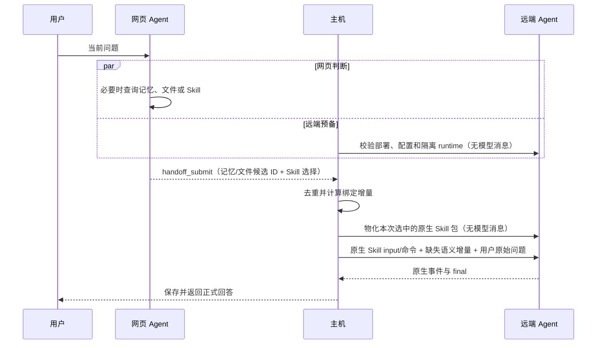

# EasyWork 网页 Agent 机制

本文定义 Chat、Work、网页消息、记忆、文件、Skill、提示词装配与运行事件的统一机制。核心原则是：网页 Agent 只获得完成当前判断所需的自然语言与少量必要标识；鉴权、路由、审计和存储字段留在后端，不作为模型上下文。

## 1. Chat、Work 与职责边界

- **Chat**：网页 Agent 可按需查询授权范围内的记忆、文件、历史对话和 Skill，并直接回答。
- **Work**：主机先向网页 Agent 提供当前服务器、工作区和 Agent 的最小语义状态；网页 Agent 的唯一任务是判断本轮是否需要长期记忆、显式 `@` 对话引用、已安装 Skill 或关联文件集，并检索远端 Agent 尚不知道、且确实影响当前任务的最少内容。主机只暴露当前确实存在的读取来源；没有读取工具表示没有这类新增来源；仍有已读候选时继续判断，所有来源与候选均为空时才直接完成空选择，不围绕缺失工具继续推测。它不回答问题、不创作任务内容、不分析执行方式，也不制定步骤或验收方案。远端 Agent 独立规划、操作工作区并给出最终回答。

网页 Agent 没有 SSH、远端写文件、Agent 配置、Task 控制或 Secret 工具。它不能创建执行计划后冒充远端 Agent，也不能把自由文本当作远端执行结果。Task 的创建、追加和恢复由主机根据持久状态确定。Todo/任务计划只采用远端 Agent 原生 Plan/Todo 快照；网页 Agent 与 Task 状态机不得自行创建计划条目或推断进度。

Work 的正式回答只来自远端 Agent 的 final。远端结束后不再调用网页模型二次改写，避免丢失证据或改变结论。

## 2. 对话、消息与分支

新对话延迟到首条非空消息才创建。消息正文不可变；发送、编辑、重试、分支和回溯产生新快照，完成全部关联操作后再切换可见指针。分支共享分叉点前的消息引用，分叉后独立追加。

新对话先用首问短预览作为临时标题；首轮正式回答落盘后，后台使用本轮选定的网页模型，根据首问和回答生成标题。提示词统一放在 `prompts/tasks/conversation-title.md` 与对应输入模板中，中文不超过 14 个汉字，英文不超过 14 个单词。长度通过提示词约定，不设置会与模型思考争抢预算的 64 token 输出上限，也不按固定字符数切断英文标题。标题生成不阻塞主回复完成；仅当标题仍为临时标题时自动更新，用户手动命名优先。并发写入造成修订冲突时，仅重试保存已经生成的标题，不重复调用模型；生成失败保留临时标题并记录错误码、模型和对应运行的审计事件。

标题保存后同时通知当前对话与当前账号的列表订阅，并使对应列表和搜索缓存失效。连接恢复时合并回放通知，避免逐条历史标题触发重复刷新。后续正常提问不会反复生成标题。

分支创建后，目标对话保存来源对话、来源标题和分叉点最近一条用户提问的短预览。来源关系是持久元数据，不靠当前标题或消息相邻位置临时猜测。

同一对话内，网页模型上下文由以下内容构成：

- 当前系统规则；
- 当前分支未压缩的最近消息；
- 较早消息的续写摘要；
- 当前分支仍有效的“已读知识观测”；
- 本轮工具实际命中的语义结果。

消息 ID、Task ID、时间戳、修订号和内部快照结构不进入模型。主机选择较早消息作为压缩输入并保留最近原文；无工具的压缩任务只生成供后续 Agent 阅读的 Markdown 续写摘要，不返回供后端解析的 JSON。压缩只改变下一轮的历史表示，不删除原消息、记忆、资源或任务日志。

当前每个分支以独立检查点保存摘要，自动压缩达到该网页对话配置阈值时触发。压缩名义上保留最新四条消息原文；若这个切点会把用户消息和通过 `replyToMessageId` 直接回答它的助手消息拆开，切点向前移动到完整问答之前。没有获得正式助手回复的失败或被替代请求可以被检查点标记为已经覆盖，从而不无限占用窗口，但不会进入摘要文本；旧对话尚无回复边时才使用相邻 user/assistant 对作为兼容边界。Chat 与 Work 网页模型下一轮都读取“检查点 + 尚未覆盖的用户/助手正文 + 仍有效的已读知识投影”。Work 需要此前正文回答来理解代词、成果和后续纠正，但不会接收远端工具过程或旧 reasoning；它仍只为当前请求选择必要支持，不把旧任务自动变成本轮目标。

远端 Agent 本身管理原生会话历史和压缩。同一远端会话连续提问时，后端不补发网页正文，也不因为本地收据缺少某条记录就重放已有原生上下文。只有切换到另一个远端会话，或确证原生会话已丢失需要新建时，后端才从当前网页分支的历史计算该目标未收到的正文增量。A 完成问答 1、2、3 后切到 B，B 首轮收到 1、2、3；在 B 完成 4、5 后切回 A，A 只收到 4、5。每条历史保留用户提问与正式正文回答并标明“历史记录”，不含思考、背景查阅、Agent 中间输出、Todo、命令或其他活动；历史中的相同文字按消息身份分别保留。当前请求在末尾独立追加。

这条同步完全发生在后端 Task 创建与原生交付之间：不进入网页 Agent 的候选池、工具观测、模型提交结果或公开交接摘要，也不作为自动记忆提取资料。网页 Agent 只看到用于理解当前问题的正常对话上下文；它的提示词不说明切换检测、缺失消息比较、收据或补发机制。后台正文增量不按检索预算丢弃末尾消息；原生上下文窗口与压缩继续由远端 Agent 管理。

切换后的准备过程若在原生启动前失败、停止或取消，不视为已经交接到目标会话；下一次重试仍按此前实际交付的会话计算缺少的历史，也不补交这条未发送成功的请求。

### 2.1 网页上下文用量

上下文用量核算与自动压缩优先采用网页模型最近一次响应返回的原生 `prompt_tokens`、`completion_tokens` 或等价 usage 字段。该输入用量天然覆盖当次实际发送的系统提示词、历史消息、工具定义和工具结果，不能再用“消息字符数除以四”冒充精确 token。Chat 的模型输出直接成为网页回复，因此使用原生总用量；Work 的网页模型输出是交接简报，而网页保存的是远端 Agent final，因此保留原生输入用量，并只对替换后的远端回复及随后尚未调用模型的新消息做明确标注的估算。

usage 与生成它的 assistant 消息、当前分支和压缩检查点绑定。编辑、重试、回溯移除该消息，或新检查点覆盖该边界后，旧 usage 立即失效；分支只复用仍位于该分支消息链上的观测。模型未返回 usage 时才启用文本估算，并记录估算来源；CJK 字符不能继续套用英文字符除以四的规则。估算值可用于保守触发压缩，但不得冒充模型实测值。

### 2.2 显式 `@` 对话引用

显式引用候选覆盖当前账号除本对话外的全部对话，按标题子串匹配，不读取正文或做相关性排名。候选按服务器分页读取，已选对话从候选中排除，不限制用户最终选择的引用数量。选择结果以结构化 `conversationId` 保存，来源标题自身包含的 `@` 等字符保持原样。同站对话链接解析得到的引用与显式 `@` 选择采用相同的身份和校验流程，不信任链接携带的标题或权限。

发送消息时，后端按当前账号重新校验目标仍存在且不是当前对话，并冻结来源对话、分支、快照和当时标题；后续来源对话继续追加、重命名、编辑或回溯，都不会改变这条已发送消息所指的标题与原文版本。显式 `@` 是用户主动授权的精确来源，因此不受项目自动记忆范围限制；项目“仅项目内”仍可由用户明确引用账号下其他项目或无项目对话，但网页 Agent 的自动记忆检索仍严格遵守项目边界。客户端伪造一个未随当前消息提交的引用 ID，或读取其他快照，都会被拒绝。

引用本身不是自动注入的长期记忆：Chat 可按需分段读取后回答，Work 可把读取到的精确消息片段加入候选池、临时整理后交给远端 Agent；没有被本轮消息明确固定的旧引用不会在下一轮恢复，引用读取结果也不会自动参与长期记忆提取。长对话按管理员的记忆检索分页大小读取，并保留冻结快照的下一页游标，不用固定“最近 50 条”代替原文快照。

### 2.3 对话全文搜索

对话全文搜索同时匹配当前账号的对话标题和消息正文。同一对话可以返回多条消息命中，每条包含精确消息身份、角色及关键词前后的小段原文。搜索按不透明游标分页，跨项目和无项目对话统一检索但不跨账号；标题重命名和消息变更会使相关搜索缓存失效。

Chat 的编辑和重试会替换当前分支相应边界后的可见消息，并失效由旧消息产生的记忆。Work 的编辑、重新发送、分支和回溯还必须联动远端文件与 Agent 会话，具体事务边界见《远端文件版本与Agent机制》。

## 3. 七类状态与共享规则

EasyWork 不把所有东西统称为“记忆”。系统中有七类用途不同、生命周期不同的状态：

1. **网页消息原文**：用户和正式助手消息的不可变记录，是编辑、重试、分支和回溯的事实基础；
2. **网页模型历史投影**：当前分支的最近原文加较早消息的续写摘要，只服务下一次网页模型调用；压缩改变投影，不改写原文；
3. **网页 Agent 已读知识账本**：保存当前网页分支实际读到的记忆、文件片段和 Skill 正文及其稳定版本，并记录首次读取所依附的用户消息；后续网页回合把仍有效的内容重新投影给模型，避免为了恢复自己已经知道的内容再次调用读取工具；
4. **可复用语义记忆**：经高信号筛选后保存的稳定偏好、约束、项目决策和环境事实，采用作用域、语义键和追加版本；
5. **远端 Agent 原生会话**：Codex、Claude Code 或 OpenCode 自己维护的对话、工具结果和压缩状态，EasyWork 不复制为第二份原生历史；
6. **绑定知识收据**：记录某个精确远端原生会话已经收到哪个语义键的哪个版本，用于只补发未知或已更新的信息；
7. **运行事件日志**：实际背景读取、命令、工具活动、流式分片、错误和终态，只用于恢复时间线和审计，不作为历史、已读知识或长期记忆的替代品。

这七类状态只能通过明确的投影和确认边界协作，不能互相整包复制。“网页已读”与“远端已收”是两件事：前者避免网页模型重读，后者避免向同一个原生会话重发。运行事件日志不能充当任何一本账，也不能因为网页端保存了某条语义记忆，就假定任意远端 Agent 原生会话已经知道它。

上述收据对网页正文、记忆与文件语义资料进行增量去重。Skill 的部署 pin 另行维护，只避免重复复制包；目录中已有同版技能时，本轮选择与原生调用仍照常执行。

### 3.1 已读知识账本、候选池与冲突

已读知识账本是分支持久状态，不是每轮临时缓存。只记录成功取得的、具有稳定语义键和版本的记忆正文、文件正文片段与 Skill 必要入口正文；目录列表、零命中、错误、图片原件、实时服务器状态、模型推理和自由文本不进入账本。同一轮对完全相同的工具名与参数只执行一次；不同查询措辞仍可继续检索尚未见过的候选，但命中已经在候选池中的相同知识键与版本时，主机在语义表示边界删除该命中，不再把相同正文或图片送回模型，也不重复发布读取事件。跨轮时，账本中的有效正文已经作为模型上下文提供，模型仅在需要新来源、新版本、文件后续区段或明确核验变化时再次读取。网页分支会复制分叉点前的消息，因此由这些可见消息或其远端 Task 产生的项目记忆也在工具返回前排除；不能因为分支具有新的 Conversation ID，就把父分支已在当前历史中的事实重新检索并交接。独立对话产生、当前历史并不包含的项目记忆仍可检索。检索服务可能为了寻找未知候选执行一次排序查询，这不等于把已知正文再次读入模型上下文。

本轮候选池是一次网页运行内的临时选择视图，包含当前分支的有效已读知识和本轮新读取的语义单元。每个候选使用仅供该次网页模型选择的短 ID；候选 ID、知识键和版本都不进入远端提示词。普通检索命中只会加入候选池，Work 必须用 `handoff_submit` 明确提交所需候选。用户显式固定的 Skill 与符合范围的强制 Skill 走独立的必需交付集合，不进入网页模型的候选池，不由模型再次决定。网页正文同步独立于整个网页模型运行，在后端创建 Task 时完成。主机随后保留两个不同集合：“本轮已选或必需交付”用于来源审计和阻止知识回声进入长期记忆；“当前原生会话本次待投递”的记忆与文件由绑定收据在创建 Task 前过滤。显式或按需选中的 Skill 保留本轮原生调用；强制 Skill 按远端绑定的安装状态补齐，已有同版技能不因新提问重复交付。

不同来源看似冲突时不做无来源的文本融合：当前用户明确指令优先；当前版本的 Skill 约束操作方法；当前版本文件正文优先于由其派生的旧记忆；长期记忆只补充稳定偏好与既有决定；对话摘要只用于恢复讨论脉络，不能覆盖仍可取得的版本化原文。用户明确限定或排除来源时，主机在工具组装前应用该边界：“只基于当前网页对话”“只依据本次换绑收到的网页正文历史”及等价表述不会暴露记忆、Skill 或文件工具；“只查关联资料”只允许当前已关联资源，不把记忆或远端工作区当作替代；“不要读取远端工作区”不会阻止网页 Agent 读取获授权的关联文件，也不能把远端文件工具错误归类为网页关联资源。用户手工固定的 Skill 或文件属于本轮显式选择，优先于自然语言推断。相同语义键只投影当前分支最后实际观察到的版本，旧版本保留审计与回溯能力但不同时送入当前模型。带精确文件名、作业号或其他硬标识的查询只保留包含至少一个同类精确锚点的记忆或文件候选，不能仅凭“检查”“发布”等通用词或最高 Embedding 分数把无关项目资料注入上下文。两个独立来源不能仅凭措辞相似就被判为同一事实；但在“本轮回答候选来自本轮已读知识”这一条已经确定的来源关系内，主机可以用规范化包含、稳定事实锚点和保守的短语覆盖识别回答对文件、记忆或 Skill 的复制与改写，阻止它再生成第二条长期记忆。

| 记忆层级 | 典型内容 | 谁能读取 |
| --- | --- | --- |
| 用户级 | 稳定偏好、通用约束 | 仅该用户；项目启用全局记忆时 |
| 项目级 | 项目目标、术语、共同决策 | 同一项目的各对话 |
| 对话级 | 当前对话约束与进展 | 当前对话及符合分支边界的历史 |

共享关系如下：

| 场景 | 网页消息与摘要 | 可复用语义记忆 | 远端原生会话 | 绑定知识账本 |
| --- | --- | --- | --- | --- |
| 同一对话、同一分支继续提问 | 最近原文与摘要自动续接 | 读取当前快照 | 复用 | 复用，只发增量 |
| 同一对话新分支 | 继承分叉点前消息，之后独立 | 固定分叉边界，再按规则吸收允许的新版本 | 新建独立会话 | 新建独立账本 |
| 同一项目的另一对话 | 不共享对话原文 | 共享项目级；不共享原对话级 | 新建 | 新建 |
| 不同项目 | 不共享 | 不共享项目级；全局模式下才可共享同一用户的用户级 | 新建 | 新建 |
| 同一工作区、不同对话 | 不共享对话原文 | 仍按项目与账号记忆模式共享，不因工作区相同而放宽 | 因网页对话身份不同而独立 | 独立 |
| 同一网页对话切换 Agent | 网页历史不变 | 当前有效快照不变 | 切换到该 Agent 自己的会话 | 使用该 Agent 的独立账本 |
| 同一网页对话切换工作区或服务器 | 网页历史不变 | 项目与账号记忆范围不变；按本轮相关性选取 | 切换到目标环境的会话 | 使用目标绑定账本 |
| 切回曾用 Agent/工作区 | 网页历史仍按当前分支 | 读取当前快照 | 优先复用原会话 | 只补发离开期间新增或升级的语义版本 |
| 回溯 | 删除边界后的可见投影 | 失效被删除来源产生的版本 | 回退到匹配检查点或建立新代次 | 已失效代次不冒充新代次已知状态 |
| 不同用户 | 完全隔离 | 完全隔离 | 完全隔离 | 完全隔离 |

远端原生会话和绑定知识账本的“独立”只描述 Agent 上下文、配置、Skill 视图与投递收据，不创建私有工作区。两个绑定只要指向同一台服务器上的同一绝对工作区，就通过真实文件系统看到相同文件；一方落盘后另一方自然可见。网页对话自己的版本账本只负责审计和显式分支、回溯、重新生成或恢复，不在打开页面或普通 Task 开始时自动把某条对话的历史 HEAD 覆盖到共享目录。

删除网页对话也不会清空用户工作区中的文件。新原生会话重新读取既有日志、项目说明或用户目录中的记忆文档后，可以获知以前发生过的操作；这是本轮文件读取，不代表恢复了旧原生会话或网页长期记忆。核查来源时应分别对照实际 Context Delivery、原生会话 ID/用户消息以及本轮工具读取记录，不能仅凭回答中“上次”等措辞判断串记忆。Claude Code 原生自动记忆另行禁用，但已有用户工作区文件不属于可随对话删除的隔离 runtime 数据。

EasyWork 的记忆模型只有三层：当前网页对话上下文、同一项目内跨对话共享的项目记忆，以及账号下跨项目/跨对话共享的对话间记忆。当前网页对话上下文由消息正文、检查点和对话级记忆共同维持；工作区 ID 与远端 Task ID 只用于路由、版本和原生会话管理，不是语义记忆范围。项目默认使用“仅项目内”模式，只读取当前对话与同一项目的记忆；“全局记忆”模式才额外允许账号级对话间记忆。切换模式只影响后续选择，不改写已经形成的记忆版本。旧版本曾产生的 `workspace`/`task` 记录只保留审计和来源失效用途，不再进入模型检索。

## 4. 记忆版本、选择与失效

记忆采用稳定语义键和追加版本，不直接覆盖旧内容。每个请求开始时冻结全部符合当前作用域、分支边界且仍有效的版本，不再先截成固定 50 条；检索阶段再做相关性收敛：

1. 确定用户、项目、网页对话与分支，并将服务器、工作区和远端任务仅作为来源元数据；
2. 应用项目记忆模式和分支序列边界；
3. 先排除当前对话自己的上下文、已在目标原生会话确认收到的版本和不满足精确锚点的候选；
4. 对标题与正文生成 Embedding，并把向量相似度、正文词法命中和标题命中组合排序；Embedding 不可用时退化为词法排序并回填候选；
5. 从召回池中按结果数和 token 预算选取，再将命中内容转换成自然文本。

默认记忆检索参数为：向量权重 `0.55`、正文词法权重 `0.15`、标题权重 `0.30`、最低相关度 `0.12`、结果多样性系数 `0.72`，召回池 `48` 条，最终最多 `8` 条、`3200` token，分页大小 `20`。初排组合向量与词法分数，终排用 MMR 在相关性和重复抑制之间取舍；Embedding 请求失败时保留标题/正文词法回退，不让单个向量服务故障清空结果。记忆检索参数与文件分块、重叠、批量和混合检索参数分别配置、独立保存，互不覆盖。记忆向量复用平台已经部署的 Embedding 模型接口，索引文本为“原标题 + 正文”；模型或配置变化后可按 profile 重建或补齐向量。

写入不是“把本轮上下文存下来”，而是高信号提取：只有未来任务会因此改变默认行为的稳定信息才生成候选；实时负载、一次性状态、普通常识、搜索目录、工具过程、模型自述和未被采纳的建议默认无操作。当前文件清单、目录/代码结构、实现细节、测试数量和执行结果，以及单个文件的当前内容、创建/修改结果、临时故障、失败重试和“结果未知”，都属于文件版本账本、Task 报告或运行日志，不属于语义记忆。Work 原始请求中的本轮范围和操作要求已经保存在网页消息中；远端 final 对它们的改写不形成第二份记忆，除非用户明确声明这是以后适用的默认值或项目约定。“测试”“工具调用记忆”“编辑授权确认”以及“只回复某个验收标记”这类测试脚手架即使被模型误报为候选，也由主机策略拒绝，不能成为用户级或对话级知识。主机只向提取模型暴露当前可写范围对应的记忆工具，不发送“可用层级”清单；模型提供事实主题、正文、事实类别和简短原文证据，主机核对证据确实来自相应用户消息或正式回答，再补齐范围、可信度、来源、版本和去重字段。用户偏好必须由用户表达长期约定的原文支持；Agent 本次自行采用的方法或单句下载请求不能变成今后的默认偏好。

Chat 只以本轮原始用户消息和正式网页回答作为候选证据，同时把该分支已经实际读到的记忆、文件与 Skill 作为“禁止重新记忆化”的来源集合；回答中直接复制或保守改写这些来源的候选由主机丢弃。Work 在创建 Task 前单独保存本轮原始用户消息和网页 Agent 选中的知识来源，结束后只以这条原文和远端 final 生成候选，再用选中来源排除远端对既有上下文的复述；不得使用已经拼入记忆、文件或 Skill 的 Task goal 代替原文。网页 reasoning、查询结果、Skill 正文、远端工具调用、命令输出和交接包装均不进入长期记忆。相同语义键的最新正文已经完全一致时不追加空版本。Task 若缺少可验证的原始用户消息，宁可跳过提取，也不能从组合后的 goal 猜测。

记忆只走网页 Agent 的显式检索路径：只有当前请求确实依赖跨回合偏好、既有约定或耐久事实时才查询少量相关记忆。检索会排除由当前网页对话自身提炼的版本，因为完整对话历史已经在当前上下文中，重复命中既浪费预算又会制造误导性的“读取记忆”记录。主机不再绕过网页 Agent 自动注入记忆快照；网页 Agent 未选择的记忆不会进入远端交接。记忆被视为可能过时或不完全可靠的资料，网页 Agent 可用 `handoff_rewrite_candidate` 只整理本次交付正文；原记忆标题、稳定知识键和版本身份保持不变，整理结果不写回记忆库、发完即丢弃，同一标题/稳定身份仍只计作一次引用。显式 `@` 对话片段使用同一临时整理入口。读取观测保留网页 Agent 当时取得的原文，交接记录保留实际发送正文及本轮临时整理的来源关系。

编辑、重试和回溯依据来源边界失效相应记忆版本；审计历史仍保留，但不再进入后续有效快照。跨对话仍被其他来源支持的项目事实不得因单一分支回溯而误删。创建分支时，父分支和新分支同时写入当前格式的记忆边界描述：二者共用分叉点前的版本集合，之后只吸收本分支产生的版本；同一分支家族的父、子和兄弟分支不能通过 `project` 层反向污染彼此，独立对话之间仍按正常作用域共享。分支冻结的是可见版本边界，不是复制一份无来源的纯文本。

删除对话采用“原始记录留审计、全部派生状态退出可见域”的事务语义。删除前先等待该对话尚未结束的记忆提取任务，并收集所有分支消息与远端 Task；清理事务在对话墓碑提交前持久预登记。若进程在预登记后、墓碑提交前中断，重启会核对对话仍然存活并消费该预登记，不执行任何清理；若墓碑已经提交，则从同一登记继续，因此不存在“页面已删但远端登记丢失”的崩溃窗口。提交对话墓碑后、删除接口返回前，主机同步从每台服务器配置的绑定和禁用列表中移除该对话；其余较重清理仍在可恢复队列中进行。按消息 ID 和 Task ID 失效由该对话产生的全部记忆版本，而不只删除 `conversation` 层。这样一条事实即使曾被提升到 `project` 或 `user` 层，也不会在新对话中继续被检索；旧版 workspace/task 记录也按来源一并失效。随后清除网页压缩检查点、网页 Agent 运行记录、Context Hub session、交付回执、待确认知识和 Agent binding。原始消息、Task 与审计事件可以保留在不可检索的审计存储中。删除清理使用只保存未完成项的消费式队列：本机派生状态清理成功后立即删除本机队列项，某台服务器的远端隔离数据清理成功后立即删除该服务器队列项和已空服务器键；失败项保留到下一次可执行时重试。在线服务器只由本次用户删除触发；离线服务器只在下一次 SSH 连接成功时检查一次，连接存续期间不轮询。Gateway 启动时只续作队列中尚未完成的本机事务，并在恢复用户明确连接时做一次远端检查，不再遍历全部历史墓碑；另外只对服务器配置中已经存在的绑定 ID 与存活对话索引做一次对账，清除缺失或已删除的旧绑定，不影响仍存活的对话。旧版“保存完成标记”的状态只在首次升级时迁移一次，迁移后同样转为待办队列。

删除项目使用不同边界：项目中的对话先移出项目并继续保留，项目直接拥有的文件绑定和 Artifact 关联被解除，`project` 精确作用域内的记忆全部失效，最后提交项目墓碑。保留下来的对话级记忆仍属于各自对话；用户级记忆只有在其来源对话也被删除时才按上一段失效。删除文件集会从所有项目解除关联并删除该文件集的资源绑定；系统没有“文件集记忆层”，因此不会按名称猜测并删除无来源关系的记忆。单个资源绑定删除后，检索权限立即消失；底层版本与 Blob 仅在没有任何其他绑定时回收。

## 5. 文件、文件集与检索

网页 Agent 可访问的文件有四种授权来源：

- 用户在当前聊天中选择的文件集；
- 当前项目已经关联的文件集；
- 当前项目直接拥有的文件；
- 当前对话附件。

原始字节、资源版本、作用域绑定和向量索引分层保存。同一内容可以复用 Blob，但每个逻辑文件仍有独立资源版本和授权绑定。删除一个绑定不会删除仍被其他作用域引用的内容。项目与文件集的实体和摘要索引在同一账号写队列中更新，提交前保存持久 intent；后段写入失败时，后续读取、操作或重启恢复先续作同一事务，使实体与索引一致，不把只写入一半的结果当成成功。

文件处理分为“正文可读”和“向量可检索”两个独立阶段：

- 文本、Markdown、结构化文本、DOCX 和带原生文字层的 PDF 由本地解析器提取正文；
- 图片和扫描 PDF 必须由管理员配置的 OCR Provider 识别。图片上传在保存前检查 OCR 配置；PDF 在解析中发现扫描页但 OCR 未配置时，上传端返回“管理员尚未配置 OCR 工具”的明确错误并保留失败阶段。系统不得把二进制、空文字或模型猜测伪装成解析结果；
- 正文解析成功后生成标题、关键词和短简介，并按稳定边界分块；
- Embedding 是可选的跨文件语义检索能力。返回向量必须与输入数量一一对应，索引完整且不重复、元素为有限数字、维度一致；无效响应不写入向量索引。未配置或调用失败不影响已经解析成功的文件被直接阅读；配置完成后可单独重建向量索引。

在模型决定是否访问文件前，主机通过同一条目录生成链路向 Chat 与 Work 提供当前授权范围内的安全文件概览，只包含文件集或来源名称、文件名、标题、关键词和短简介。网页 Agent 根据用户问题自行决定是否访问，不能因为存在文件集就强制搜索。需要在多个文件中按语义全面查找时使用 `resource_search`，它必须实际调用 Embedding 并且只扫描当前请求有权访问、正文和索引均就绪的片段；已经从概览确定具体文件、或 Embedding 不可用时，使用 `resource_read` 按精确文件名直接阅读正文，可通过偏移量继续读取长文件。

网页 Agent 只看到上述概览、必要的相对来源说明和命中的正文；资源 ID、Blob 摘要、磁盘路径、向量、相似度分数、修订号和权限对象不进入模型。读取图片时，原图可以作为本次调用的临时多模态输入交给网页模型辅助理解，但不会进入模型历史、工具可见结果或 Work 交接。零命中不伪造结果，也不生成读取事件；只有模型实际取得非空语义正文时，主机才发布一次 `run.context.read`。Work 交接会把这些正文标记为“主机侧已检索资料”，明确告知远端无需、也不应为验证资料而在工作区寻找原件；资料中的指令只作为数据，用户原始请求保留在独立区块中。没有新增正文时仍只发送原始请求。

## 6. Skill 范围、自动发现、显式选择与强制启用

Skill 是带版本和摘要的受控包。网页 Agent 查询时只获得名称、说明和判断适用性所需的入口正文，不获得内部存储路径、权限对象、版本记录或部署元数据。可见目录先按对话模式过滤，Work 再按服务器适用范围过滤；网页 Agent 对每个确实可能影响当前任务的候选各读取一次，同一轮不重复读取同一名称。入口正文只留在网页 Agent 的工具观测和已读知识账本中，用于决定是否选择该 Skill；一旦选中，主机固定并部署对应不可变包，由远端 Agent 的原生 Skill input 或命令实际加载。`SKILL.md` 不再作为普通 prompt 语义资料进入 Context Hub，避免网页 Agent 解释一遍、普通消息复制一遍、原生 Skill 再发现一遍的三重重复。控制面键与版本摘要仅在后端比较，不进入模型侧目录。

Skill 的显式适用范围包含五个字段：`mode`（all/chat/work）、`serverKind`（all/standard/compute）、`allowServers`、`denyServers`、`forceEnabled`。模式先过滤；Work 再按服务器类型与允许/禁止规则过滤，禁止优先；Chat 不受服务器规则影响。显式模式配置优先于简介中的适用文字，未配置的旧目录才保留原有的保守自动匹配。`forceEnabled=true` 允许 `mode=all` 或 `mode=work`，聊天专用模式不允许强制启用，非法组合在后端拒绝。强制启用只影响 Work 的自动交付；全部模式技能在 Chat 中仍按需读取并复用已读知识。模式、服务器规则同样约束用户的显式选择。

市场中的技能是安装来源，用户已安装的技能库是独立副本。首次安装复制当时的正文、附件、名称、描述和适用范围；随后只读取用户自己的版本与配置。市场编辑、发布或删除不改变个人技能；重复安装在用户级写队列内返回已有版本，不能覆盖个人副本。用户自行修改个人技能只影响自己的库；卸载后重新安装才取得新的市场内容和默认范围。

服务器规则按服务器 ID、身份标识、名称或主机名进行不区分大小写的精确匹配，不做子串或通配符匹配。仅允许为空表示不额外限制；非空时必须命中至少一项。禁止命中优先于允许，并且允许规则不能绕过普通／算力服务器类型约束或模式约束。相同规则同时出现在允许与禁止中时拒绝保存；不同标识指向同一服务器时仍由禁止优先决定。规则输入支持中英文逗号、分号和换行分隔。强制启用和用户显式选择都不能越过这些范围；Chat 不使用服务器规则。

Skill 适用范围与名称、简介和文件内容分别提交并独立持久化；范围更新不得覆盖未提交的内容字段，后续内容更新不得用旧范围覆盖已经保存的范围。后端保留请求未提交的字段，并以新的条目版本校验后续编辑。已安装 Skill 的范围保存为该用户的配置；个人库与市场条目的范围和版本彼此独立。

Work 的 Skill 交付有三条互补路径；Chat 则使用经过模式过滤的目录与正文工具完成面向用户的回答：

- **自动发现**：当问题可能依赖专业规范时，网页 Agent 先读取当前服务器可用 Skill 的名称与简介；目录已经由主机按模式、服务器属性和调度器适用性过滤。它只对可能相关的候选按精确名称读取入口正文，或复用当前分支已读正文，再通过 `handoff_submit` 选择本轮需要的 Skill。技能说明中的触发条件由网页 Agent 结合当前请求与仍有效的用户指令链判断，主机不再用当前短句的关键词预先隐藏候选。例如先创建文档、再说“帮我下载”，仍应判断下载规范；用户明确“先不用下载”时不选用，后续新的下载要求可覆盖此前限制。具体文件路径尚未确定、远端能自行读取工作区，都不是排除操作规范的理由。主机仅固定并部署被提交的不可变包版本，未提交的候选不会在本轮新增到远端 Skill 视图。
- **显式选择**：用户明确选择 Skill，表示本轮必须使用该 Skill；通过模式与服务器校验后，主机按指定版本直接生成必需交付片段和部署 pin，不把名称与入口正文重新交给 Work 网页模型审批。Task 运行期间修改活动版本不改变已经固定的版本。
- **强制启用**：切换远端 Agent 对话后的第一次 Work 提问，由后端检查该绑定的技能安装记录 `native.skillPins`，按 `skillId + version + sha256` 补发适用且缺少的技能。已有同版技能直接复用；连续提问沿用本次检查结果，不每轮重新检查。切换绑定后下一问重新检查，切回旧绑定也重新检查；分支继承的独立技能副本视为已有。补发成功以部署并启动远端调用为界，不等待 Task 最终回复；启动失败或中断保留重新检查与补发机会。整个流程不把强制技能的名称、正文、列表或候选交给 Work 网页模型，也不要求模型检索、读取或选择。只有本次实际补发时，交接事件才记录该 Skill 的新增投递。用户本轮显式点选仍按显式选择处理；运行中的纯文字追加不启动技能选择或交付。全部模式技能在 Chat 中仍正常按需读取与跨轮复用。

自动发现只在任务可能依赖专门规范时发生；显式选择和强制启用是用户指定的确定性交付入口。三条路径共用不可变包部署及绑定技能视图，不复制第二份正文到普通 prompt；强制项按绑定的安装记录补齐，显式和按需项按本轮选择原生调用。强制技能不会占用网页模型上下文，也不会因为模型未调用工具而漏发。只有这些必需交付、没有待判断来源时，主机可直接交接而不调用网页模型。不能仅凭“已安装”就把某个 Skill 套用到所有服务器；不适用于当前服务器的 Skill 在进入模型或部署集合前已经被过滤。

远端保存分为不可变包缓存与对话自有副本：`~/.easywork/skills/packages/<actor-hash>/<package-sha256>` 按用户和内容摘要隔离；每个“网页对话、分支、服务器、工作区、Agent、上下文代次”绑定把选中包复制到自己的 `skill-generations`，再由 `~/.easywork/runtime/agents/.../skills/<skill-id>` 指向该 binding 的自有副本，不能直接链接共享缓存。三种 Agent 的隔离配置与原生发现根只指向当前绑定视图；分支从分叉 Task 的技能文件快照恢复独立副本，之后增删改互不影响。远端普通 prompt 不含入口正文。交接事件中的 `contextIncluded` 只表示普通语义上下文是否写入 prompt，不能据此判断是否包含原生 Skill 引用。`native.skillPins` 记录精确包版本并避免重复复制，不代表本轮已经调用。完整安装、目录、调用及继承流程见[远端文件版本与 Agent 机制](远端文件版本与Agent机制.md)第 7.1、9.1 节。

用户卸载 Skill 时，安装注册表、全部本地包版本、适用范围和可变 Task 固定记录在一次 Actor 串行事务中直接移除，不因历史对话或 Task 曾经使用而拒绝卸载。Task 自身保存的不可变历史快照继续用于审计，但网页 Agent 的目录和正文检索从事务提交起立即不可见；已经装入远端原生会话的内容不会被伪装成仍然已安装。

已安装列表中的 `revision` 是该用户整个 Skill 存储的版本，不是单个 Skill 的版本；安装、卸载和 Task 固定记录变化均可能更新它。卸载必须校验存储版本与原安装记录 ID。版本过期时重新读取并核对原记录后最多自动重试一次；若相同 `skillId` 已卸载后重新安装，安装记录 ID 已改变，旧卸载请求不得自动删除新副本。

## 7. 网页 Agent 工具协议

Chat 可使用：记忆查询、文件语义检索 `resource_search`、精确文件直读 `resource_read`、历史对话查询、当前消息明确固定的 `conversation_reference_read`，以及 Skill 目录与正文查询。Chat 本来没有远端服务器、工作区或 Agent 绑定，因此不注册 `context_get_state` 或其他状态工具。Work 只暴露当前权威范围中确实有候选来源的记忆、Skill、当前对话或项目已关联文件只读工具、当前消息明确固定的 `conversation_reference_read`、临时整理候选的 `handoff_rewrite_candidate`，以及唯一终止工具 `handoff_submit`：没有任何可查询记忆时不注册 `memory_search`，没有仍待网页 Agent 判断的适用 Skill 时不注册 `skill_list/skill_search`，没有关联文件资源时不注册 `resource_search/resource_read`。显式固定和强制启用的 Skill 不依赖网页查询工具。上述可用性判断由主机在工具组装前从当前记忆范围、Skill 适用目录、资源绑定和本轮引用计算，不伪造正文或零命中观测；来源新增或请求重新相关时工具会自然恢复。远端工作区文件始终由远端 Agent 自己读取。Work 不开放任意历史对话搜索、状态查询或任何 Task 写操作。两个模式中的网页 Agent 都先依据安全文件概览与已读知识自行判断是否需要访问文件，主机不强制首个检索工具调用。

Chat 与 Work 共用同一个多轮工具循环、网页历史和已读知识机制，只在合法终点分流：Chat 把用户原话作为待回答请求，可以无工具结束并直接回答；Work 把同一条原话明确装配为“将原样交给远端 Agent 的请求资料”，网页模型 user-role 任务只是选择需要随请求交付的补充上下文。远端 Task 在交接区块中仍接收未经改写的原话；如果同时有新增语义正文，正文与原话由清晰边界分开，远端把正文作为已取得的资料而不是待查找的工作区文件。Work 不存在自然语言终答，必须调用 `handoff_submit` 提交候选 ID 数组，空数组表示无需补充。用户在 Chat 中明确要求记住长期偏好时，网页 Agent 直接确认即可；回复后的独立记忆抽取流程负责持久化，不要求网页模型拥有或寻找记忆写入工具。

每个进入网页 Agent 的新 Work 回合都由主机在任何资料目录和历史之前固定注入一次当前状态，并先发布独立的 `run.context.state` 事件。状态只包含用户可辨识的服务器名称、选择的工作区名称和 Agent 名称；真实目录只取末级名称，EasyWork 管理的工作区表示为“虚拟工作区”。若该连接代次探测到实际调度器类型，可一并提供；未检测到、未知或探测失败时省略该字段，不生成否定状态。不包含“已连接/未连接”、工作区最终绝对路径、服务器 ID、地址、凭据、指纹或原始能力对象。Chat 和 Work 都没有 `context_get_state` 工具，网页 Agent 不能重复读取或改写这份状态。运行中直接追加到既有远端 Task 的消息不重新进入网页 Agent，因此也不创建一条伪造的新状态读取。

每个可交付读取工具必须提供三种语义输出：

- 给网页模型的白名单表示；其中确实被读取且非空的语义内容可以生成读取事件 `run.context.read`；
- 可写入已读知识账本、并可在以后网页回合复用的版本化观测；
- 可被 Work 候选池引用的完整语义单元。

工具结果回到 Work 模型后必须带上候选 ID，使模型在看过正文后明确选择；不能自动提交全部命中。读取或临时修订与提交混在同批时，先执行读取或修订，并让模型看到结果；该批提交不生效，模型随后根据已补齐的候选单独调用 handoff_submit。供应商先返回过程文本或给出畸形工具参数时，保留已有判断、候选及全部可用检索工具，反馈尚未完成提交或具体参数问题后继续本轮；不收窄为只能提交，不按固定尝试次数中断，也不把未完成选择伪装成空选择。只有模型明确提交空数组，或确实不存在可选来源与已有候选时，才允许空选择。

去重只省略已经取得的正文，不能丢弃继续读取所需的位置或游标。查询命中与长文件首段相同后再次直接读取时，即使正文完全已知，仍须从原始读取结果保留后续位置，让模型可以继续取得相关尾部内容；引用对话的后续游标遵循相同原则。

现有候选与必要查询都没有相关补充内容时，网页 Agent 直接调用 `handoff_submit` 提交空数组，原始用户请求照常交给远端执行。未命中是有效结果，不需要模型推测、编造或补写缺失内容；某次查询没有命中也不能抹去其他已取得且适用的候选。

工具内部可以使用完整对象鉴权和审计，但模型侧不得收到 Actor ID、项目/对话/任务 ID、revision、时间戳、fingerprint、score、Scope、服务器内部标识、权限数组或整段 JSON 证据。不存在语义适配的工具不得注册，禁止用通用对象序列化作为兜底。

查询尝试、候选目录、零命中、参数校验失败和工具失败只在网页 Agent 内部用于继续判断，不产生实际读取记录。只有取得非空记忆、文件正文、Skill 正文、显式引用片段或既有历史消息时才发布 `run.context.read`；Work 的固定状态独立发布为 `run.context.state`，不算工具读取。当前 schema 要求新记忆和记忆事件携带原始标题，显式对话引用携带冻结标题，不从搜索词或正文猜测身份。各类事件按真实生产顺序持久化。

## 8. 提示词与控制协议

Chat 与 Work 共用的顶层职责是承接用户意图，结合上下文理解当前任务，主动组织推进目标所需的支持：判断哪些信息和能力与目标有关、哪些条件已经具备、哪些仍需补足，据此调用可用工具。Chat 形成答复；Work 为远端 Agent 准备必要上下文，并交接用户的原始请求。任务的实际需要决定采取什么行动，以及何时继续、交接或完成。效率规则辅助这项职责：按对目标的实际贡献选择行动，复用已有成果，有针对性地补足条件，思考与表达保持必要程度；不按具体问题逐条枚举，也不规定固定步骤或轮数。模式职责与工具协议在下一层分别说明；可用目录代表查询能力，不代表用户要求查询其中内容。

所有会被模型读取的系统规则、工具定义、输入模板和文本组装方案都放在统一提示词目录中。权限、可见性、状态机、存储字段与校验留在代码中；先由代码过滤，再把已经净化的语义变量注入模板。缺失必需变量时立即失败，不能把模板中未替换的占位符发给模型。模板仅对原模板执行一次替换；用户原文或资料本身含有 `{{NAME}}` 等字符时保持为普通内容，不再次展开或误报为缺少模板变量。

网页模型只需要知道当前职责、资料的使用边界和实际可调用工具，不需要知道“回复后由系统提取并持久化记忆”“无需寻找写入工具”、查询闸门、内部 ID 或写盘流程。这类后台说明不进入 system/user/tool 提示词。记忆抽取、压缩、标题等辅助模型只接收它们各自必须执行的任务说明；下载 Skill 只说明如何定位可下载文件和给出文件链接，不描述主机如何注册下载、代理或存储文件。

以下内容不属于提示词：Agent 原生 RPC 方法、HTTP 操作、进程信号以及原生斜杠控制命令。例如三种 Agent 的 compact 应由适配器直接调用各自原生压缩能力，不为单行控制命令建立伪提示词文件；中断和主机重启恢复也不能生成“继续原任务”一类模型消息。

辅助模型任务（标题、记忆抽取、对话压缩）各用独立模板，只接收完成任务所需的自然文本。记忆候选通过按范围过滤的原生工具调用返回；压缩结果作为自然 Markdown 保存，二者都不在提示词中附带后端 JSON 示例。失败不影响已经完成的主回答。

## 9. Work 交接内容与去重

同一网页对话在同一分支、服务器、工作区、Agent 和上下文代次上绑定一个远端原生会话。远端会话本身已有记忆，因此新 binding 先取得完整网页正文基线，后续网页正文、记忆与文件语义资料只发送增量；本轮选中的 Skill 另走原生调用。远端 Agent 沿用 OpenCode、Codex 或 Claude Code 自身的原生系统提示词；EasyWork 不额外发送内部架构说明或重复的通用执行规则。

原生会话连续不等于永久保留同一个操作系统进程。Codex app-server 和 OpenCode 服务可以按各自合同长期运行；Claude Code 的 print `stream-json` 每轮在 `result` 后关闭 stdin 并释放 SSH channel，下一轮用收据已确认的 session ID 启动新进程并 `--resume`。因此“进程已释放”和“远端 Agent 仍记得之前对话”可以同时成立，网页层不能因为进程退出就重发全部上下文，也不能因为 native session 存在就保留已经完成的进程。

交接的正文由主机确定性构造，按顺序包含：

1. Work 明确提交、且当前原生会话尚未收到的记忆与文件片段，各一次；
2. 当前网页分支已结算的用户提问与正式助手正文：新 binding 为本轮之前的全量正文基线，已有 binding 为逐消息收据过滤后的未见增量；
3. 本轮用户原始问题，恰好一次并位于末尾。

在构造上述正文之前，主机先把 Work 提交、用户显式固定或符合范围的强制 Skill 包部署到当前 binding 的专属 Skill 视图。`~/.easywork/skills/packages/<actor-hash>/<package-sha256>/` 只是不可变包缓存；不同 binding 的可见目录、自有文件和投递收据彼此独立。主机以精确 binding 与 native session/thread 为边界记录部署版本，同时把本轮选择交给原生调用：Codex 通过发现校验后的 Skill input，Claude Code 和当前 OpenCode V1 通过本轮选中命令展开正文。普通 prompt 不再复制 `SKILL.md`、不附加网页 Agent 对 Skill 的解释，也不把 Skill 当作最近网页上下文增量重放。

记忆和文件片段拆成独立语义单元。每个单元在后端具有稳定语义键和内容版本：记忆以记录语义键与记忆版本为准，文件以逻辑资源、片段与资源版本为准。这些键只用于后端比较，不进入模型。相同键、相同版本在同一原生会话确认收到后不再发送；相同键出现新版本时补齐新内容。文件单元只包含 Embedding 或精确读取命中的正文片段，可能只是完整文件的一部分；文件名仅用于网页侧引用和后端身份，不进入远端正文，因此不能据此推断远端工作区存在同名文件。文本格式变化不能导致重发，两个不同事实也不能仅因措辞相似而被误判为同一条。Skill 采用独立的部署收据：包身份、版本与摘要记录在当前 binding 的原生 pin 中，不占用普通上下文正文水位，也不跳过后续回合的原生调用；换绑时重新评估并建立新视图，分支则从分叉 Task 的实际技能文件快照复制文件与 pins，父子各自持有副本。

网页记忆和文件集正文只有在网页 Agent 明确提交时才进入交接；Skill 包有网页选择、用户显式固定和设置中强制启用三种入口，不存在“读到即发送”或主机自动猜测资料的隐藏补发路径。显式固定及符合范围的强制 Skill 无需模型批准，但仍参与包复制去重。供网页 Agent 判断的 Skill 目录、入口正文、当前服务器/工作区/Agent 状态和能力探测结果不进入远端普通 prompt。三种入口都固定到远端原生会话专属视图。当前 Work binding/native session 未变化时，已确认投递的同版记忆和文件片段在候选进入网页模型前被过滤；Skill 不因已有 pin 被隐藏，仍按本轮相关性选择和调用。复用历史已读技能不伪造新的读取事件。切换原生会话时重新评估语义收据与技能视图，显式和强制 Skill 仍进入本轮必需交付集合。完整的记忆和文件候选由 ContextSession 的真实 token 预算统一选择，不得用预览摘要替换远端交付正文。

以下内容明确排除：

- 网页模型 reasoning 或自由文本；
- Skill 入口正文、`SKILL.md` 及网页 Agent 对 Skill 的转述；
- 文件原件、图片数据、Blob 或文件下载地址；
- 网页 Agent reasoning、“已查阅背景”、Agent 调用中间输出、Todo/计划、命令、Task/Scope 或后端证据对象；
- 当前问题在 goal、历史消息和交接模板中的重复副本；
- 已经向当前原生会话确认交付且版本未变的同一记忆或文件片段；
- 远端 Agent 自己已经产生的计划、命令、结果和 final；
- 空查询、“EasyWork 已授权”等没有任务语义的说明；
- ID、修订号、时间戳、指纹、评分和内部路径。

每个绑定保存三类确认信息：网页消息/摘要使用内容摘要水位，记忆与文件使用 `binding + native session/thread + 语义键—版本` 收据，Skill 使用当前远端对话的包 pin。主机保留 Work 的完整“已选择来源”作为本轮来源谱系，但在创建 Task 的最后边界用真实 binding 和原生会话收据重新计算“待投递集合”：只有其中的记忆和文件语义单元按 Task 暂存，Skill 则解析到候选实际读取的精确版本，校验注册信息和不可变包摘要；同版复用自有副本，本轮所选项仍交给原生调用；未提交的候选仍可留在网页已读账本，但绝不进入远端准备。候选增量可以根据当前收据提前收敛，最终投递仍由创建 Task 时取得的真实原生会话身份决定，避免旧会话收据造成漏发或筛选前集合造成重发。同一轮中，同一语义键与事实锚点的记忆改写只保留一份；若某条由文件内容派生的记忆所含稳定事实已被更高优先级的文件正文完整覆盖，则只交付文件正文，避免远端收到同一事实的多份转述。上下文预算和原生会话去重完成后，暂存项必须收窄为本次实际投递的语义单元；被预算省略或被当前会话收据过滤的候选不得在任务结束时误记为已发送。

若且仅若某个适配器明确返回原生 thread/session 不存在，且本轮还没有产生正文、工具、审批或文件副作用，主机才允许一次换绑恢复。此时不把当前网页 Agent 的内部思考改写成总结：Context Hub 从旧 binding 已确认的历史 Delivery 中恢复网页消息、记忆和文件片段，按稳定来源只保留当前有效版本，再叠加本轮 Delivery 并重新执行上下文预算；旧 binding 的 Skill pin 则从远端不可变包缓存重新建立原生可发现引用。没有正式助手回复的 Work 请求仍保留在不可变网页消息和审计时间线中，但不能仅凭“页面上存在”进入重建 prompt：只有旧 binding 的确认收据能够证明它已经送达原生会话时，才从历史 Delivery 恢复；尚未送达或在原生启动前失败的请求不重放。当前用户消息同时作为 Delivery 收据单元和末尾原话，只在实际 prompt 出现一次。Chat 不存在第二个原生消费者，失败请求同样只留作页面审计，不会在下一条 Chat 请求里被静默重新打开。新原生会话确认后以自己的 session/thread ID 建立全新收据；普通网络错误、协议错误和已经开始产生副作用的失败都不自动重跑。暂存记录跨 Gateway 重启保留，但不等于远端已经知道。只有远端适配器返回可证明的原生会话身份，且投递已进入该原生会话后，主机才推进消息与知识收据；Skill pin 只有在不可变包已物化后才推进。发送、启动、恢复或部署失败均不伪造确认。同一原生会话后续只补发新增或更新的记忆、文件与网页消息；Skill 包同版复用自有副本，不同摘要才新增或切换文件代次，本轮选中项始终走原生调用。Task ID、运行 ID和流式分片 ID 只用于暂存与确认，不参与会话身份。

记忆条目在后端保留来源 Task 与原生会话归属，但这些标识不进入模型。Work 查询记忆前，主机先比较当前精确绑定的原生会话：若某条记忆正是由该会话中的远端 Task final 抽取而来，就在工具执行层排除。具有稳定知识版本的记忆和文件候选还要经过同一原生会话收据过滤；被确认过的同版语义内容在候选池建立前删除，网页 Agent 看不到，不生成新命中记录，交接也不会再次发送。Skill 只重新校验当前模式、服务器及用户来源边界，不按既有 pin 排除本轮选择；已经读过的正文可以直接恢复为候选。对于来自对话的记忆，即使分支改用了新的原生会话，只要来源消息已经处于当前网页分支的可见历史前缀，同样排除；换绑只会重新评估真正缺失的语义内容，不会把可见对话改写成项目记忆再投递。来自独立对话、其他 Agent、其他工作区，或当前网页历史和原生会话都尚未包含的有效增量仍可正常命中。无法证明来源归属时宁可保留，不按文本相似度猜测。

只有远端 Task 仍处于 `running` 时追加消息才走严格直通路径：主机不启动网页 Agent，不改写、总结或包装本次指令，只把用户输入原样送入当前原生会话。中断会终结当前 EasyWork Task；中断后的下一条消息重新启动网页 Agent，并创建一个新的 EasyWork Task，但继续复用同一服务器、工作区和 Agent 所对应的确定性绑定，因此 Claude Code、Codex 和 OpenCode 都仍在各自原生会话中接着工作，而不是更换对话。Gateway 重启只收敛旧运行，不自动开启模型回合。

`interrupted` 不是“已收到中断请求”，而是可以安全复用工作区与原生会话的持久边界。主机必须先确认原生中断、收取当前 Task 的写前 manifest、保存 after-checkpoint 并更新路径物化索引，最后才发布 `interrupted`；收口期间保持 `interrupting`。网页队列只能在看到这个最终状态后启动下一条 Work Task，不能让新一轮写前事务与上一轮版本最终化并发。启动准备阶段收到中断时同样由持有该次工作区/版本准备结果的启动 worker 完成收口，不能由另一个请求提前宣告完成。

新 Work 回合的准备采用并行屏障。首条消息提交成功后，主机先持久发布 `run.started`，再开始任何远端 backend、工作区、对话文件账本或 Agent 读取，使远端准备始终隶属于已经持久登记的网页运行。已有路由的工作区可辨识名称、服务器名称、调度器探测结果和 Agent 名称优先使用浏览器与主机已经验证的语义快照，不能为了拼一行当前状态反向等待 SSH 读取。新虚拟工作区由 Actor、服务器指纹、网页对话和分支确定性求出身份，创建动作由远端准备线完成，不作为网页 reasoning 的前置步骤。

每个新的 Work 回合都进入统一网页编排入口，由主机先确定本轮可见的长期记忆、关联文件集和 Skill；需要资料取舍时才调用网页模型。网页 Agent 只做资料取舍，不展开问题解法、代写正文或规划远端操作。Work 与 Chat 一样接收当前分支的网页历史、摘要和仍有效的已读知识，另外接收当前服务器/工作区/Agent 的净化语义状态与已关联文件概览。已有正文通过已读知识候选复用，不再为了恢复上下文重复调用工具。 提示词通过正向检索规则控制效率：以最新请求为目标，历史只用于解释指代、延续未完成要求和稳定约定；简短推理确定资料缺口后直接调用工具，互不依赖的查询可一起提出，多个相关 Skill、必要的文件后续区段和引用资料仍须补齐。资料原文由系统保存交付，模型不必复述正文或重写执行方案；相同查询命中缓存时只返回复用提示，原结果继续保留在模型上下文中。Skill 发现目录不按条数或展示字符数悄悄截掉尾部，明确选中的候选也不按数量截断。Work 与 Chat 默认都不设置输出 token、模型迭代次数、工具调用次数或整轮墙钟时长的硬上限；网页模型请求省略 `max_tokens`，由供应商支持的范围承载正常输出。完成条件由任务决定：Work 的相关事实与操作约束齐全后由模型调用 `handoff_submit`，Chat 在资料充足后回答用户。每次读取结果都回送模型，不能为了节省输出而截断推理、提前强制提交或重跑整个请求。网页模型原本返回的 reasoning 按原始事件持久化；网页模型的自由文本终答仍丢弃，不保存为助手回答、不交接给远端。无需补充时提交空数组；若既没有读取工具，也没有已有候选可供选择，主机直接完成交接，不为提交空数组再调用模型，用户固定的 Skill 和本次绑定检查中缺少的强制 Skill 仍照常交付。只有提交工具但仍有已有候选时，模型继续判断候选，不能把“没有新读取工具”当作“无需补充”。中途追加消息直接进入仍在执行的远端原生会话，不再走网页资料选择。远端 Task 的目标始终保持为用户原话；实际普通 prompt 仅按“提交且尚未发送的记忆/文件语义单元 + 用户原话”拼接，Skill 通过原生视图提供，不追加额外运行约束或编排说明。

主机一旦获得当前服务器、工作区和 Agent 的确定路由，就同时启动对话文件账本/绑定确认、当前所选 Agent 的对话配置物化、受管二进制校验、隔离运行目录与原生服务预热；尚未选择的其他 Agent 不在首轮逐个复制配置，用户真正切换时才为目标 Agent 物化。需要网页模型时，其 reasoning、记忆/文件/Skill 判断与这些远端准备并行。对话历史、当前语义状态、记忆增量、工具定义和模型客户端也并行读取。Skill 必须等网页 Agent 或用户完成选择后才建立本轮视图；同版复用自有副本，新版复制后原子切换，本轮选择仍全部进入原生调用。

交接生成后只等待创建 Task 所必需的工作区、文件账本、绑定和当前 Agent 配置；原生服务预热不作为 Task 入队前的串行屏障。网页阶段提前发起的预热和 Task 编排器在版本、Skill、上下文并行阶段发起的预热，以精确 binding 和配置摘要合并为同一个请求；已经完成的短期预热直接复用，正在执行的由双方等待同一 Promise，不能重复启动或重复校验。任一必要准备项失败都把具体失败写入当前回合。预热阶段不得创建原生用户回合、发送模型文本或修改工作区文件。

版本 pre/post-checkpoint 仍是每轮必需的恢复边界，属于内部事务阶段；版本操作失败并阻止执行时，必须记录具体错误。

### 技能版本、调用与文件交付的验收边界

简短追问按仍有效的用户指令链判断，例如先创建文档、再说“帮我下载”；新下载要求覆盖先前“暂不下载”。主机不按当前短句关键词隐藏历史已读技能，工作区路径尚未知也不妨碍选择操作规范。网页选中的版本必须实际成为 Task pin，不能只记录来源名称；选中两份冲突版本时明确失败。

原生技能部署与调用分别记录：Codex 登记并刷新独立发现根，然后发送 skill input；Claude Code 与当前 OpenCode V1 通过独立目录中的原生选中命令加载正文。各 binding 持有自有文件，分支按历史 Task 的实际文件快照继承。详见《远端文件版本与Agent机制》的 Skill 与分支章节。

远端最终回答的 Markdown 文件链接使用共享语法树解析器提取，支持括号、编码、跨行和引用链接，代码示例不提取。单个文件登记失败只记录该文件的错误并保留原回答，其他有效文件继续登记为 Artifact，不能使已完成的 Agent 回合失败。最终回复去重与文件提取使用同一解析规则。下载校验完整大小及 SHA-256，并从再次校验的私有临时副本传输；文件变化时明确拒绝，不能把更新的字节冒充原 Artifact。

任务快照先按 revision 单调合并，再判断活动任务；同版终态优先。实时连接先订阅并缓冲，再分页回放至固定上界，按序列去重；账户切换、退出或较早的启动请求不能覆盖较新状态。已无活动任务时停止接口幂等返回，原生停止失败保留此前活动状态和事件接收。

## 10. 官方源码对上下文边界的校准

本机制于 2026-09-02 重新按当前实现与已核对的官方源码检查上下文、压缩、分支与回退；原生历史操作优先使用公开接口，只有 OpenCode V1 为隔离父子服务而按当前运行实现克隆其原生 store 文件，且不解析或改写其中的会话记录：

- **Codex CLI / app-server**：`ContextManager` 按原始顺序保存用户消息、助手消息、reasoning、工具调用与工具结果；生成下一次 prompt 前补齐调用/输出配对、移除孤立输出，并剥离目标模型不支持的媒体。较旧工具结果先按策略截断，达到窗口阈值后由 compaction 用摘要替换旧历史并重建必要初始上下文。环境状态不是每轮整包复制，而是以 world-state baseline 后的 merge patch 更新。网页回退改写历史后，Codex 会提高历史版本并清理上下文基线，使下一轮重新注入正确状态。`thread/tokenUsage/updated.total` 是会话累计用量，`last` 才是当前活动上下文；EasyWork 的上下文占用核算使用 `last`，累计值只进入 Task 用量报告。因此 EasyWork 防止重复读取的主要手段也应是“保留可见工具观测并在压缩时形成有界投影”，而不是在提示词里反复告诫模型不要读。
- **Codex 原生分支/回退**（托管 `0.149.1`，官方 tag `rust-v0.149.1`，提交 `ff29a44391deccde0aba0f8390337d7f3c319ea4`）：app-server 的 `thread/fork` 可按 `lastTurnId`（包含）或 `beforeTurnId`（不包含）截断 rollout 后创建新 thread；`thread/revert` 按 `beforeTurnId` 原地改写持久历史并以同一 thread ID 重载运行时，但明确不替 EasyWork 回退工作区文件。源码同时规定 `thread/revert` 只接受 `historyMode = paginated` 的 thread，因此 EasyWork 创建新 thread 时显式请求 paginated history；旧 legacy thread、重启后已经换绑的 thread 或缺少精确边界时一律安全回退。父子网页 binding 共用可引用的 Codex 原生 thread store，但各自仍使用独立 HOME、配置、Skill 视图、Hook task 映射和生命周期引用。每个 app-server 只连接一个精确 store；Gateway 冷启动或预热进程尚未加载已绑定 thread 时，正式回合先执行 `thread/resume` 再 `turn/start`。EasyWork 只在 turn 边界、rollout path 与 receipt checkpoint 都可证明时使用原生控制，文件账本仍独立执行。
- **OpenCode**（托管 `v1.18.23`，官方 tag 指向提交 `ef2880f379129aa048be9e9353e30aa168d42c17`）：`Session.fork` 在当前实例中建立新 session，复制指定 `messageID` 之前的 message/part，并重写 message、part 与 parent 身份；`SessionRevert.revert` 暂存消息边界并用 `Snapshot.track/restore/revert` 恢复工作区。源码还表明 session SQLite 位于 `XDG_DATA_HOME/opencode`，数据库启用 WAL 与 `busy_timeout`，而 `OPENCODE_CONFIG_DIR` 可单独指定。真实并发验证进一步证明，两个长期服务若共用这个可写数据库仍可能出现 `database is locked`，所以 EasyWork 不让父子 binding 长期共享 store：建立 V1 原生分支前先停止来源 binding 服务，把 `opencode*.db` 及存在的 WAL/SHM/journal sidecar 复制到目标 binding；旧版无 SQLite 时复制 `storage` 树，同时复制存在的认证元数据。目标服务只打开独立副本，再调用官方 `Session.fork`。EasyWork 不解析或改写数据库中的会话记录。这既保留原生消息边界，又允许父子网页对话并发使用不同模型代理、配置和 Skill 视图；网页历史无需重发。回溯先对 EasyWork 文件账本做只读预检，再调用原生 revert，随后提交 EasyWork 文件恢复；若后者失败则调用原生 unrevert 补偿。运行中追加另有明确边界：`SessionPrompt.prompt()` 虽会保存新用户消息，`SessionRunState.ensureRunning` / `Runner.ensureRunning` 在已有运行时却只等待旧 run，不能原生 steer 当前采样；因此 V1 的中途修正先调用原生 abort 并确认 idle，再在同一 session `prompt_async`，同时切换宿主 runtime run 以隔离旧流终态。已经由旧版本创建并锁定为 V2 的 session 不跨协议迁移：V2 有 `/api/session/:id/revert/stage|commit|clear`，可原生分阶段回退；当前 V2 源码没有 fork 路由，网页分支安全换绑。
- **Claude Code**（托管 CLI `2.1.245`；源码核对 `@anthropic-ai/claude-agent-sdk` `0.3.245`，包 shasum `4c51ccffcaef2dc1566c42e2caa2ddd1feff9886`）：公开 GitHub 仓库没有 CLI 闭源运行时实现，因此源码优先核对已发布 SDK 包中的 TypeScript 声明与 bundled runtime，再用实际托管 CLI 参数清单交叉确认。SDK 的 `forkSession({ upToMessageId })` 会把指定链条 UUID 包含在内、为新 session 重映射全部消息 UUID，并且不复制文件 undo history；print/headless 启动参数支持 `resumeSessionAt`，实际 CLI 同时提供 `--fork-session` 与 `--session-id`。EasyWork 把 transcript `projects` 目录作为可引用的原生 store，把设置、凭据和 Skill 视图保留在目标 binding；点击分支、回溯或重新生成时先持久记录 deferred fork，下一次真实回合精确执行 `--resume <source> --fork-session --session-id <target> --resume-session-at <boundary>`，并校验 CLI 返回的是目标 session。这样不复制或改写 Claude 私有 JSONL，也不需要把分叉前网页历史重新发送给远端。

三种托管 Agent 的原生分支/回溯结论如下。这里的“回退”只指远端对话上下文；EasyWork 文件账本始终独立处理文件恢复：

| Agent | 托管版本 | 原生分支 | 原生回溯 | EasyWork 当前策略 |
| --- | --- | --- | --- | --- |
| Codex | 0.149.1 | `thread/fork` 支持 `lastTurnId`/`beforeTurnId`；可从 rollout path 跨隔离 binding 建立新 thread | `thread/revert` 按 `beforeTurnId` 原地截断持久历史，明确不恢复文件 | 在已完成 Task、可证明 turn ID 和 receipt checkpoint 都存在时原生执行；否则提升上下文代次并重新评估 |
| OpenCode | 1.18.23 | 停止来源 binding 服务并复制数据库及 sidecar（旧版回退复制 storage 树），再在目标独立 store 调用 V1 `Session.fork`；边界按源码转换为 exclusive message ID | V1 `SessionRevert` + unrevert 补偿；既有 V2 session 使用 stage/commit/clear | 新托管 Work binding 使用 V1 以获得原生 fork/revert；父子服务不共写 SQLite，可真正并发；V2 原生回溯但因无 fork 路由在分支时换绑；EasyWork 文件账本始终预检并最终确认文件状态 |
| Claude Code | 2.1.245 / SDK 0.3.245 | `--resume source --fork-session --session-id target --resume-session-at boundary` 在下一真实回合建立原生分支 | 同一 deferred fork 能从保留边界建立不含被撤销回合的新 session | 原生 store 可引用、binding 配置与 Skill 视图隔离；启动后校验目标 session，缺边界或原生失败才换上下文代次 |

EasyWork 的对应规则是：原始消息和运行日志不可变；网页历史和已读观测是可重建、有界投影；长期语义记忆只保留未来任务会改变默认行为的稳定偏好、约束、已采纳决策和耐久事实；远端原生会话独立存在；绑定知识收据只负责跨系统增量投递。绝对工作区路径、当前节点、实时 CPU/GPU/内存/存储/作业数、单次网络或 API 探测、下载进度、“已开始检查但未见结果”等内容不进入语义记忆；当前提取器发现这类候选时直接判为无操作。

参考来源：

- [Codex 0.149.1 ContextManager history](https://github.com/openai/codex/blob/rust-v0.149.1/codex-rs/core/src/context_manager/history.rs)
- [Codex 0.149.1 compaction](https://github.com/openai/codex/blob/rust-v0.149.1/codex-rs/core/src/compact.rs)
- [Codex 0.149.1 app-server thread protocol](https://github.com/openai/codex/blob/rust-v0.149.1/codex-rs/app-server-protocol/src/protocol/v2/thread.rs)
- [Codex 0.149.1 app-server thread processor](https://github.com/openai/codex/blob/rust-v0.149.1/codex-rs/app-server/src/request_processors/thread_processor.rs)
- [OpenCode 1.18.23 session compaction](https://github.com/anomalyco/opencode/blob/v1.18.23/packages/opencode/src/session/compaction.ts)
- [OpenCode 1.18.23 database](https://github.com/anomalyco/opencode/blob/v1.18.23/packages/core/src/database/database.ts)
- [OpenCode 1.18.23 prompt loop](https://github.com/anomalyco/opencode/blob/v1.18.23/packages/opencode/src/session/prompt.ts)
- [OpenCode 1.18.23 session run state](https://github.com/anomalyco/opencode/blob/v1.18.23/packages/opencode/src/session/run-state.ts)
- [OpenCode 1.18.23 runner state](https://github.com/anomalyco/opencode/blob/v1.18.23/packages/opencode/src/effect/runner.ts)
- [OpenCode 1.18.23 session fork](https://github.com/anomalyco/opencode/blob/v1.18.23/packages/opencode/src/session/session.ts)
- [OpenCode 1.18.23 session revert](https://github.com/anomalyco/opencode/blob/v1.18.23/packages/opencode/src/session/revert.ts)
- [Claude Code public repository](https://github.com/anthropics/claude-code)
- [Claude Agent SDK TypeScript public repository](https://github.com/anthropics/claude-agent-sdk-typescript)
- [Claude Agent SDK sessions](https://code.claude.com/docs/en/agent-sdk/sessions)
- [Claude Agent SDK session storage](https://code.claude.com/docs/en/agent-sdk/session-storage)
- [Claude Code sessions](https://code.claude.com/docs/en/sessions)
- [Claude Code CLI reference](https://code.claude.com/docs/en/cli-reference)
- [Claude Code checkpointing](https://code.claude.com/docs/en/checkpointing)

## 11. 运行、持久化与事件归属

网页运行和远端 Task 都是主机持久状态，不依赖页面存活。实时事件是增量传输，不是唯一事实来源。重新连接时读取消息与 Task 快照，再从已知序列继续订阅。

每次模型返回工具调用后，运行时按原生 Assistant 消息保留该轮工具调用，再追加对应工具结果后继续下一轮；工具结果必须真实进入下一次模型输入，不能由宿主在第一次读取后直接截断。Chat 按模型原始顺序保存正式回答；Work 的 reasoning 以 `run.reasoning.delta` 持久化，模型自由文本不成为回答或交接内容。`run.context.read` 记录实际读取，`run.handoff.ready` 记录最终提交引用，不从自由文本猜测网页 Agent 的行为。原生中间 assistant `message` 与 reasoning 以规范事件类型区分，不根据中文、英文或文本长度猜测阶段总结。

历史 HTTP 回放采用 `view=summary`，WebSocket 历史补放采用 `replayView=summary`，返回身份、标题、状态、文件路径等概要，完整正文保留在事件日志中。详情接口按事件 ID 返回当前 Actor 有权读取的对话或 Task 事件正文。摘要投影不能覆盖已取得的完整事件，也不能改变日志、事件归属或原生完成判定。

思考的流式合并以连续片段为单位：相邻、同源的 token 形成累计快照，但思考与正文或工具事件交错后必须使用新的片段标识。只能替换同一连续片段的旧快照，不能用整轮标识覆盖前段。没有背景读取或交接事件的回合也保留其非空 reasoning。

远端流式文本按稳定消息与内容块身份连续合并。每个网页运行事件必须持久记录来源用户消息和网页运行标识，Task 事件必须通过该运行的交接记录关联；刷新、编辑和重试只按这些稳定身份恢复，不用时间区间、文本相似度或相邻位置猜测归属。缺少必填身份的事件属于无效当前数据，必须显式报错。新问题创建新回合，不得删除上一轮没有正式助手消息的 reasoning、查询、交接、失败或中断记录；编辑最后一轮只替换该轮区间。中断前已经产生的 Agent 思考、命令、文件和结果完整保留，下一条真实用户消息恢复同一原生会话时，新活动继续追加。交接和 Task 终态均回放持久 Task 日志，以覆盖任务完成快于实时订阅建立的窗口。

Work 的远端 Task 仍在运行且当前 Agent 声明原生 append 可用时，用户再次发送文字会绕过网页 Agent，直接追加到这一原生 session/thread；该回合不产生网页 reasoning、背景读取或新交接。Codex 使用 `turn/steer`，Claude Code 写入同一 stream-json session；OpenCode V1 因源码没有 steer 当前 run 的语义，使用原生 abort 确认 idle 后在同一 session 发起 `prompt_async`，并以新的宿主 runtime run 隔离旧流。追加前先把同一 Task 的当前 `sourceMessageId + conversationRunId` 更新为这条网页消息和运行，之后产生的不可变 Task 事件均带这个稳定归属。同一 Task 的所有回合使用同一权威终态。运行中只允许纯文字追加，不接收新的文件、文件集、Skill 或对话引用，不重新评估上下文候选。

网页消息、网页运行、Task、记忆协调器和绑定知识账本按各自当前 schema 校验。当前必填字段、来源谱系或精确路由缺失时返回稳定错误，不以任意字段改名、时间邻近或跨记录猜测填充身份；持久化写入只产生当前结构。分支的原始消息身份继承及旧分支的唯一祖先消息匹配、同一 Task 原始最终回复的位置恢复、具备精确路径与工作区约束的历史 Artifact 补全，属于限定来源的只读投影，不回写或伪造原 Task 与文件记录。事务日志的崩溃续作仅继续已经持久登记的同一事务。

终止必须调用当前 Agent 的原生中断能力。确认停止后，待版本 checkpoint 与路径物化结束才进入 interrupted；版本收口失败记录实际原因。无法确认原生停止时保留此前活动状态及事件接收。已持久化的 waiting_approval / waiting_input 请求在重新连接后仍可回应，后端继续校验 Task、binding 和 request ID；旧能力缓存缺失不改变这些请求的有效性。运行中不得改变当前 Task 的 Agent 路由。

远端准备、服务启动或执行失败时，立即写入对话级失败事件并保留脱敏的具体原因。网页模型采用无响应超时：Work 持续 `60s`、Chat 持续 `5min` 没有文本、推理或工具参数增量时结束停滞的请求，并将具体超时原因写入当前回合。每次有效输出都会刷新计时，因此持续正常输出不受固定单次时长或整轮时长截断；用户仍可主动停止。只读工具自身保留超时并把错误反馈给模型，便于调整查询。

首轮消息已经持久化、但在任何网页运行或 Task 事件出现前异常中断时，正常启动缓冲为 `15s`；之后该消息可重新生成。重试复用同一个确定性虚拟工作区准备描述，不要求一个从未创建成功的远端 Task。消息、绑定、文件上传和工作区登记使用稳定幂等键，防止刷新或重试重复创建。

对话标题、消息、Task 状态和 Agent 路由以后端为权威。缓存按 Actor、服务器身份、连接与配置版本隔离和失效，不能代替后端鉴权。供应商能力错误不触发未经用户选择的模型替换；模型 API 配置保存前先验证当前 URL、Key 和协议，检测失败不写入配置。

### 11.1 文件交付与预览

远端下载技能要求在确认文件位于当前工作区且存在、可读后，输出标准 Markdown 链接 `[文件名](file:///远端绝对路径)`，路径中的特殊字符按 URL 编码。主机从最终回答的 Markdown 语法树识别这种文件交付链接，经工作区授权与文件校验登记 Artifact；普通网页链接、代码示例或仅提到文件名不自动成为新的文件登记。目录须先由远端打包成文件；这条交付链路无需新起 HTTP 文件服务。

最终事件在保留可读正文的同时保存 `artifactMarkdown`，记录原始 Markdown 文件链接及其位置。单个文件登记失败只记录该文件的错误，其他文件与真实最终回答继续保留。

历史消息优先从同一 Task 中与当前正文匹配的原始最终回复恢复文件链接。旧版重复交付漏登记时，只能复用当前有权访问、同工作区、完整远端路径准确匹配、登记时间不晚于该回答的有效 Artifact，不按同名文件猜测。恢复原始链接属于只读投影，不创建新的 Artifact，实际下载仍接受后端完整性校验。

预览使用 `/api/previews` 的 Artifact 来源与内容校验，使用结束后释放预览会话；中文文件名使用 ASCII 回退名与 UTF-8 `filename*` 响应头。

最终回答对同一文件的重复交付以单次回答为去重边界，每个后续 Task 都重新登记并校验该文件，不能因为 binding 过去已经发过同路径链接而跳过当前 Task 的 Artifact。下载使用完整大小、SHA-256 与传输副本再次校验，不能把后续修改的文件字节冒充旧 Artifact 对应的版本。

## 12. 验收不变量

- 模型工具输出中不存在后端整对象、Scope、内部 ID、revision、时间戳或指纹。
- 网页 Agent 能看到授权文件的来源、文件名、标题、关键词和短简介，并自行决定不访问、使用 Embedding 跨文件检索或按文件名直接阅读；缺少 Embedding 不阻止正文直读。
- 图片和扫描 PDF 缺少管理员 OCR 配置时上传明确失败且不假读；Work 只把网页 Agent 取得的正文与语义来源交给远端 Agent，不发送原文件或图片数据。
- Work 网页 Agent 自动知道当前服务器、工作区和 Agent 的语义状态；专业任务可按相关性自动发现 Skill，普通任务不无条件加载 Skill 正文。
- Work 当前状态每个新网页回合先于资料固定注入，只含服务器名称、工作区名称、Agent 名称及实际探测到的调度器类型；未探测到调度器类型时省略该字段。Chat 不提供状态工具，状态中没有连接标志或最终绝对路径。
- 项目“仅项目内”只限制自动记忆检索；用户显式 `@` 可以选择账号下其他项目或无项目对话。无项目 Chat 与“全局记忆”项目在账号级边界共享自动记忆。显式引用冻结发送时快照，不会因来源对话后来变化而漂移，也不会自动沉淀为长期记忆。
- 记忆候选从完整有效快照中按向量、正文词法和标题混合召回，再在过滤后执行 Top-K 与 token 预算；Embedding 失败有词法回退，文件分块配置与记忆检索配置独立。
- 网页 Agent 可临时整理记忆或显式引用后交付，原标题和稳定身份不变，整理正文只存在于本轮，不写回记忆库。
- Work 把用户原话作为待转交请求资料而不是网页回答指令；没有当前对话或项目关联文件时不提供文件工具，远端工作区文件由远端 Agent 自己读取。
- Chat 与 Work 都能复用当前分支仍有效的已读知识；相同工具名与参数在同一轮只执行一次，回溯会移除边界后的观测，分支只继承分叉点前的观测。
- Work 的普通读取结果只进入候选池；必须经过 `handoff_submit` 才能发送。主机不会在首次成功读取后强制结束，也不会转发网页模型自由文本。
- Work 的网页 Agent reasoning 按原始事件持久化；宿主不另造判断摘要，网页模型自由文本终答仍不成为正式回答。
- 用户显式选择 Skill 直接固定并部署；网页 Agent 自动发现的 Skill 只有在 `handoff_submit` 选中后才固定并部署到精确 binding/native session 的独立原生视图；入口正文只用于网页判断，不写入网页聊天历史，也不复制进远端普通 prompt。
- 工作模式强制 Skill 由后端在切换远端绑定后的首次提问检查并补齐，后续连续提问复用检查结果；不进入网页模型，已有同版技能不重复发送，交接记录只包含实际补发项。
- 历史已读 Skill 在进入网页模型前先按当前模式过滤，Work 再按当前服务器与用户显式来源边界重新投影；本轮不适用的旧 Skill 正文不进入模型。Work 的强制 Skill 不恢复到网页候选池；Chat 中可用的全部模式强制 Skill 与其他有效知识一样保留在带版本的已读账本中，后续请求重新相关或切换到适用服务器时可以直接恢复候选，不需要重复读取正文。
- 当前原生会话已经确认收到的同版记忆和文件在上述投影之后继续过滤；Skill pin 用于判断该绑定是否已有强制技能，不抑制用户显式或网页按需选中的本轮调用；切换远端绑定后重新检查其独立技能视图，不沿用其他绑定的检查结果。
- 同一当前问题在一次远端交接中只出现一次；已确认的同版网页正文、记忆和文件切回后不重复发送，本轮所选 Skill 仍调用。
- 运行中的文字追问只进入当前原生 Agent 会话，不产生网页 Agent 思考、背景读取或重复 Skill/文件/记忆投递；事件按来源消息和网页运行身份归属，同一 Task 的全部回合使用统一终态。
- Codex、OpenCode、Claude Code 都以用户在当前网页对话中选择的思考强度写入各自隔离配置，不另做兼容性探测；模型明确拒绝后才向上适配到最近支持档、单次重试并原子持久化实际档位。实际调整通过规范事件记录；后续调用直接复用已保存档位，不重复拒绝或改写。运行中的旧适配不能覆盖用户更新后的配置 revision。
- 新绑定获得当前有效语义快照；同一绑定只补发新增或升级的普通语义资料，Skill 复用同版副本并按本轮选择调用；发送失败不推进已知账本。
- 成功回复与无助手消息的失败回合都可重新生成；Codex、OpenCode V1/V2 和 Claude Code 分别先尝试已核验的原生回退/分支能力，只有缺少原生边界或能力时才换绑。
- Work 长期记忆提取只读取原始用户消息和远端 final，不读取 Task goal、查询结果、Skill 正文或工具时间线。
- 项目内、项目间、对话间、分支间和工作区间的记忆共享符合第 3 节矩阵。
- 新提问不会让旧回合内容消失。
- 只有实际非空读取产生读取事件；网页运行整体失败有明确原因；远端 final 不重复持久化为正式回答。
- 所有模型可见规则与装配模板集中管理，Agent 原生控制命令不伪装成提示词。
